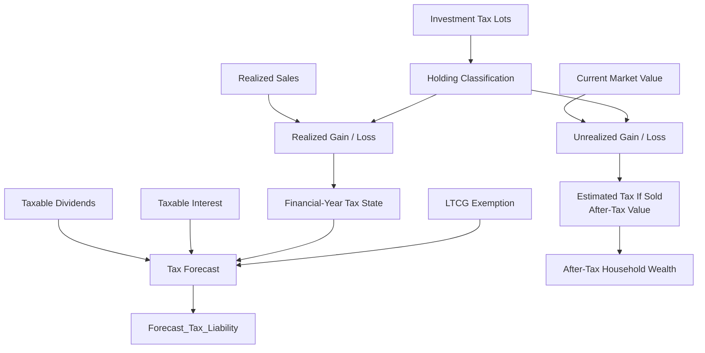

# Tax Methodology

Tax analytics in Personal Finance ETL are integrated with the investment and household models.

The system does not treat tax as one percentage applied to portfolio return.

Tax state depends on:

- individual investment lots,
- holding periods,
- realized events,
- unrealized events,
- instrument tax treatment,
- exemptions,
- taxable income components,
- and configured jurisdiction-specific rules.

> The current implementation reflects the tax regime encoded for my financial environment. It is methodology documentation, not tax advice.

---

## Tax model at a glance



---

## Tax-lot foundation

Tax methodology begins at lot grain.

Purchases create lots with acquisition context.

Sales consume FIFO inventory.

Each lot can be classified according to:

- instrument tax type,
- acquisition date,
- current/sale date,
- holding period,
- and configured tax rules.

This makes tax state temporal.

---

## Holding-period classification

A lot's tax treatment can change as it ages.

The system can track:

- holding age,
- days until long-term classification,
- short-term/long-term state,
- and applicable tax treatment.

For a realized event, classification is evaluated at the sale date.

For an active lot, classification continues to evolve over time.

---

## Realized gains and losses

When a sale consumes a lot, realized P&L is classified into tax-relevant buckets.

Current analytical concepts include:

```text
Realized LTCG
Realized STCG
Realized Gain

Realized LTCL
Realized STCL
Realized Loss

Realized Net P&L
```

These values are aggregated with financial-year awareness.

---

## Financial-year context

Tax reporting is period-sensitive.

The investment engine therefore does not treat realized gains as one lifetime cumulative number for all purposes.

Financial-year-aware state allows downstream tax forecasting to reason about the relevant tax period.

---

## Unrealized tax state

Active lots can carry:

```text
Unrealized LTCG
Unrealized STCG
Unrealized LTCL
Unrealized STCL
```

These values are not tax already owed.

They describe the current tax classification of unrealized investment P&L under the model.

---

## Estimated tax if sold

The lot model can estimate tax exposure if the current position were realized.

Conceptually:

```text
Current unrealized taxable gain
    ×
applicable modelled tax treatment
    =
estimated tax if sold
```

The actual implementation is lot-aware and can involve different tax classes/rates.

This is a planning estimate, not a filed liability.

---

## After-tax close value

Conceptually:

```text
Current Market Value
   -
Estimated Tax If Sold
   =
After-Tax Close Value
```

This tax-aware terminal state feeds:

- after-tax XIRR,
- after-tax portfolio state,
- and household after-tax market wealth.

---

## After-tax XIRR

After-tax XIRR is calculated from tax-aware investment state.

It is not:

```text
XIRR × (1 - tax rate)
```

The terminal value reflects lot-level tax exposure.

This is methodologically important because different active lots can have different:

- holding periods,
- gains/losses,
- and tax treatments.

---

## Equity and debt treatment

The current implementation contains jurisdiction-specific treatment for investment tax types.

During the v6 audit, the model included separate treatment for equity and debt mutual-fund contexts, including a debt-MF regime cutoff around:

```text
2023-04-01
```

and tax parameters conceptually corresponding to:

```text
Debt_MF_Pre_Cutoff_LTCG
Debt_MF_Pre_Cutoff_STCG

Debt_MF_Post_Cutoff_LTCG
Debt_MF_Post_Cutoff_STCG
```

This is one reason the current engine should not be described as jurisdiction-neutral.

---

## Equity tax parameters

The rules also include configurable equity-oriented concepts such as:

- LTCG rate,
- STCG rate,
- long-term holding threshold,
- and LTCG exemption.

The exact values belong to configuration and can evolve with tax law.

Documentation should explain methodology without freezing one tax year's rates into architecture prose.

---

## LTCG exemption

The tax forecast tracks use of the configured long-term capital-gains exemption.

Current serving concepts include:

```text
LTCG Exemption Used
LTCG Exemption Remaining
```

This allows realized long-term gains to be interpreted in the context of remaining exemption capacity.

---

## Taxable dividends

Dividend income can contribute to household tax forecasting.

The implementation can source dividend tax assumptions from macro/reference configuration with fallback behaviour where applicable.

That fallback is useful operationally, but it also means assumption provenance matters.

---

## Taxable interest

Interest income can similarly participate in taxable household state.

Tax forecasting therefore combines investment disposal state with other taxable income components rather than treating capital gains as the entire tax model.

---

## Tax forecast

`Forecast_Tax_Liability` is the Gold planning mart for tax state.

Current concepts can include:

- realized STCG,
- realized LTCG,
- realized gains,
- realized STCL,
- realized LTCL,
- realized losses,
- realized net P&L,
- taxable dividends,
- taxable interest,
- LTCG exemption used,
- LTCG exemption remaining,
- projected tax bill,
- effective tax rate,
- harvesting offset remaining,
- and tax harvesting capacity.

---

## Projected tax bill

The projected tax bill is a modelled planning output.

It uses current realized/taxable state and configured tax assumptions.

It is not:

- a tax filing,
- a legal opinion,
- or a guarantee of final liability.

---

## Effective tax rate

The serving model can expose an effective rate derived from projected tax relative to the relevant taxable base.

The exact denominator should be interpreted from the physical contract.

---

## Harvesting model

The current tax-harvesting logic is deterministic and lot-aware.

It is not an AI trade optimizer.

The engine can classify active lots into actions such as:

```text
HARVEST_LOSS
HARVEST_LTCG_EXEMPT
WAIT_FOR_LTCG
HOLD
```

---

## `HARVEST_LOSS`

Used when current unrealized loss state creates a tax-harvesting opportunity under the implemented rules.

This is a signal to inspect, not an automatic trade instruction.

---

## `HARVEST_LTCG_EXEMPT`

Used where realizing long-term gain can potentially make use of remaining configured exemption capacity under the methodology.

---

## `WAIT_FOR_LTCG`

Used where a lot is close enough to long-term classification that waiting can be favoured by the configured threshold.

The rules include a configurable `harvest_wait_days_threshold`.

---

## `HOLD`

Default/no-action classification when the implemented harvesting conditions are not met.

---

## Harvesting offset remaining

Represents remaining realized gain context that could potentially be offset by losses under the model.

---

## Tax harvesting capacity

Represents modelled capacity for available loss state to offset relevant taxable realized gains.

This is a planning metric.

It does not include every real-world consideration that can affect whether a trade is appropriate.

---

## Tax and broker reconciliation

Reconciliation can create or adjust lot state when broker-reported positions disagree with reconstructed transaction history.

That has tax implications.

For example, zero-cost adjustment inventory can mechanically restore quantity but may not represent complete historical tax basis.

This is a known methodological caveat.

Tax analytics are only as reliable as the lot history/reconciliation state supporting them.

---

## Tax and household wealth

Tax state flows into household planning.


This is one of the reasons tax is not isolated in a separate calculator.

---

## Tax and performance

Tax also changes investment performance interpretation.

```text
Pre-Tax XIRR
        vs
After-Tax XIRR
```

can differ materially when embedded gains are large or holding classifications differ.

The model therefore supports both perspectives.

---

## Tax assumption provenance

The current system can use:

- explicit FinancialRules,
- macro/reference values,
- and fallback assumptions

depending on the specific calculation.

Long term, I want sensitive assumption provenance to become more visible.

A future analytical-quality model could distinguish values such as:

```text
CONFIGURED
REFERENCE
FALLBACK
RECONCILED
ESTIMATED
```

That is a future design direction, not current contract behaviour.

---

## Jurisdiction boundary

The current tax model contains Indian financial/tax semantics.

That includes regime-specific rules and dates.

A future generalized architecture should separate:

```text
TaxStrategy
    ↓
jurisdiction-specific behaviour
```

from:

```text
FinancialRules
    ↓
rates / thresholds / parameters
```

Tax behaviour should not become a giant configuration file pretending complex legislation is just data.

---

## Current tax limitations

## Not filing software

The model is designed for planning and analytical context, not statutory tax filing.

## Reconciliation sensitivity

Incomplete transaction history can affect tax-lot basis.

## Regime evolution

Tax laws change.

Configured rates/thresholds and behavioural code must remain current.

## Fallback assumptions

Fallbacks improve resilience but can reduce methodological provenance if not surfaced clearly.

## No universal jurisdiction support

The current model is purpose-built.

---

## Tax invariants

1. **Tax state begins at lot grain.**
2. **Holding classification is time-dependent.**
3. **Realized and unrealized state remain distinct.**
4. **Financial-year context remains explicit for realized analytics.**
5. **After-tax return uses lot-aware terminal state.**
6. **Tax forecasting remains a planning model, not a filing engine.**
7. **Harvesting outputs remain decision-support signals.**
8. **Reconciliation effects on tax basis remain visible as a caveat.**
9. **Jurisdiction-specific behaviour is not presented as universal.**
10. **Tax parameters and tax behaviour remain conceptually separate.**

---

## Related documentation

- [Investment Analytics](investment-analytics.md)
- [Financial Model](financial-model.md)
- [Metrics & Methodology](metrics-and-methodology.md)
- [Cash Flow & Wealth](cashflow-and-wealth.md)
- [Financial Rules](../configuration/financial-rules.md)

[← Finance Home](README.md) · [← Documentation Home](../README.md)
