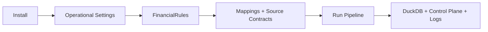

# Getting Started

This section gets the current application from **installed** to **running against a valid financial environment**.

It is deliberately operational.

For architecture, finance methodology, or extension design, follow the links into the deeper sections.



## Read in this order

| Step | Guide | Purpose |
| ---: | --- | --- |
| 1 | [Installation](installation.md) | Install Python/package and prepare the environment |
| 2 | [Configuration](configuration.md) | Configure paths, mappings, databases and financial policy |
| 3 | [Running the Pipeline](running-the-pipeline.md) | Run CLI, desktop or automated execution and understand outputs |

## Two configuration planes

```text
Settings
→ where / how the application runs

FinancialRules
→ what financial activity means
```

The distinction is fundamental. A database path is operational configuration. A rebalance tolerance, tax parameter, or cash-pool classification is financial policy.

## Current portability boundary

Installing the package is not sufficient to run it against an arbitrary user's financial data.

The current implementation still assumes compatible source contracts, mappings, and jurisdiction-specific financial behaviour.

For that boundary and the generalization plan, see:

- [Project Overview](../about/project.md)
- [Roadmap](../about/roadmap.md)

[← Documentation Home](../README.md)
