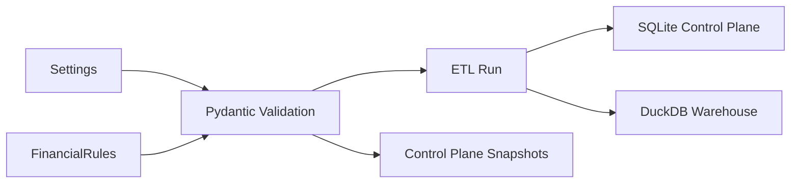

# Configuration

Personal Finance ETL separates **operational configuration** from **financial policy**.

That boundary should be understood before running the application.

```text
Settings
→ where and how the application operates

FinancialRules
→ what financial activity means
```

---

## 1. Configuration flow



Both configuration planes are validated before analytical engines rely on them.

---

## 2. Settings

Settings describe the operational environment.

Typical concerns include:

```text
source folders
database/output locations
reference-file paths
hash policy
application paths
```

These values tell the software **where things are and how the runtime should operate**.

They should not define household financial meaning.

---

## 3. FinancialRules

FinancialRules describe financial semantics.

Examples include:

```text
income classification
expense classification
cash/non-cash treatment
core expenses
cash pools
asset groupings
target allocation
rebalance tolerance
tax assumptions
FIRE assumptions
```

These values can change analytical results even when the source files are identical.

For the full methodology, see [Financial Rules](../configuration/financial-rules.md).

---

## 4. Example: rebalance policy

The current policy model makes tolerance explicit:

```python
class PortfolioManagementRules(BaseModel):
    rebalance_tolerance_pct_points: float = Field(
        default=5.0,
        ge=0.0,
    )
```

That is financial policy.

The algorithm that calculates allocation/drift remains in analytical code.

```text
value changes
→ configuration

behaviour changes
→ code boundary / strategy
```

---

## 5. Source paths

Operational Settings must point to the source environment expected by the current adapters.

Examples can include:

```text
statement folders
personal-finance SQLite source
MF ISIN reference
benchmark mapping
opening balances
other masters/reference files
```

A valid path does not guarantee a valid source contract.

The file still needs the structure/semantics expected by its extractor.

---

## 6. Target database paths

The runtime needs locations for:

```text
SQLite Control Plane
DuckDB analytical warehouse
snapshots / outputs where configured
```

The two databases have different responsibilities.

Do not merge them conceptually just because both are local files.

---

## 7. Hash policy

The Control Plane can decide whether an already-known artifact should have its content hash rechecked based on physical file type.

The synchronization code conceptually asks:

```python
file_type = FILE_TYPE_MAP.get(
    category,
    "csv",
)

should_check_hash = getattr(
    hash_policy,
    file_type,
    False,
)
```

Hash policy is an operational/performance choice.

It determines how aggressively the runtime verifies that a known path still represents the same content.

---

## 8. Full-replace source policy

Some source categories represent current reference state.

Others represent historical/event evidence.

The Bronze lifecycle therefore supports:

```text
full replacement
or
file-aware historical replacement
```

This is configured/implemented according to source semantics.

Do not convert a historical source into full-replace merely to simplify loading.

---

## 9. Cash-pool configuration

FinancialRules defines which assets participate in direct cash reconciliation.


Changing the cash pool can change reconciliation even if transactions are unchanged.

That is why this belongs to financial policy.

---

## 10. Core expense configuration

FIRE and other planning analytics can depend on the definition of sustainable/core spending.

That classification should be explicit.

```text
all historical expense
≠ necessarily core planning expense
```

The project does not assume every outflow should be capitalized into the FI target.

---

## 11. Portfolio target configuration

Portfolio management compares:

```text
actual allocation
vs
target allocation
```

Target allocation belongs to FinancialRules/reference policy.

The market determines actual allocation.

The policy determines desired allocation.

Then the analytical engine calculates drift.

---

## 12. Tax configuration/reference state

Tax methodology can depend on:

```text
tax type
tax subtype
holding period
financial year
rates
exemptions
```

Some of this state can live in FinancialRules; some can live in reference tables.

The important rule is that tax assumptions remain explicit and inspectable.

---

## 13. FIRE configuration

FIRE assumptions include families such as:

```text
withdrawal policy
market regimes
regime transitions
inflation
fat tails
jumps
human-capital shocks
glide path
portfolio drag
simulation controls
```

See [FIRE Configuration](../configuration/fire-configuration.md).

Those values describe the scenario model.

They are not forecasts generated by the application.

---

## 14. Configuration validation

Pydantic validates structure and admissibility.

For example:

```python
rebalance_tolerance_pct_points: float = Field(
    default=5.0,
    ge=0.0,
)
```

Validation can prevent:

```text
wrong type
missing required value
impossible range
invalid nested structure
```

It cannot prove that a financial assumption is economically sensible.

That remains a modelling judgement.

---

## 15. Configuration provenance

At run start, Settings and FinancialRules are serialized and content-addressed.

Conceptually:

```text
configuration payload
      ↓
SHA-256
      ↓
snapshot identity
      ↓
run_id
```

Identical configuration can be referenced by multiple runs without storing duplicate payloads.

This lets the Control Plane answer:

> **Which operational and financial configuration produced this run?**

---

## 16. Configuration change discipline

Before changing a value, classify the change.

### Operational

Examples:

```text
folder moved
database path changed
hash policy changed
```

Expected result:

```text
runtime behaviour can change
financial methodology should not
```

### Financial policy

Examples:

```text
cash-pool membership changed
rebalance tolerance changed
core expense definition changed
FIRE assumption changed
```

Expected result:

```text
analytical output may intentionally change
```

That distinction is useful during reconciliation.

---

## 17. Configuration is not a substitute for adapters

Do not solve fundamentally different source behaviour with endless switches.

Use:

```text
same behaviour, different value
→ configuration

different source behaviour
→ adapter / extractor

different asset behaviour
→ asset pipeline

different financial algorithm
→ strategy
```

This keeps configuration understandable.

---

## 18. Before running

Validate:

- source paths exist,
- target locations are writable,
- mappings/reference inputs are present,
- Settings load successfully,
- FinancialRules load successfully,
- source contracts are compatible.

Then proceed to [Running the Pipeline](running-the-pipeline.md).

---

## Related documentation

- [Financial Rules](../configuration/financial-rules.md)
- [FIRE Configuration](../configuration/fire-configuration.md)
- [Adding a Data Source](../developer/adding-data-sources.md)
- [Reliability & Recovery](../architecture/reliability-and-recovery.md)

[← Getting Started Home](README.md) · [← Documentation Home](../README.md)
