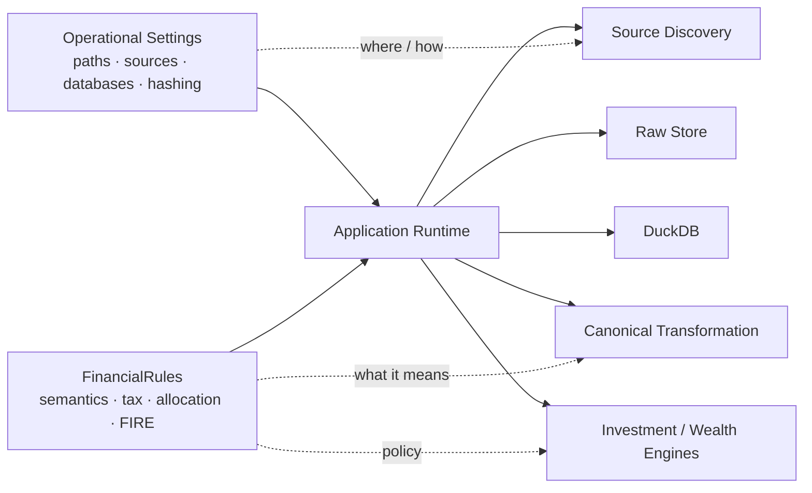

# Configuration

Personal Finance ETL separates configuration into two different concerns:

```text
Operational configuration
        +
Financial policy
```

I keep them separate because a filesystem path and a tax rule are both configurable, but they are not the same kind of decision.

Operational settings answer:

> **Where and how does the application run?**

Financial rules answer:

> **How should the system interpret financial meaning?**

This guide focuses on the operational side and explains how it connects to the financial-policy layer.

For the policy model itself, see [Financial Rules](../configuration/financial-rules.md).

---

## Configuration architecture



The distinction is architectural, not merely organizational.

---

## Operational settings

The current configuration model requires concrete local paths for the financial environment.

Important settings include locations corresponding to concepts such as:

```text
SOURCE_DB_FOLDER
STATEMENTS_FOLDER

COLUMN_MASTER_PATH
MF_ISIN_CSV_PATH
BENCHMARK_MAPPING_CSV_PATH
BENCHMARK_MASTER_CSV_PATH
MACRO_PARAMETERS_CSV_PATH
OPENING_BALANCE_CSV_PATH
```

The exact configuration contract is validated by the application's Pydantic models.

These paths are purpose-built around the current source environment.

They should not be interpreted as a universal source schema.

---

## Source locations

### Source database folder

The source database folder points the application toward configured database-style source inputs.

The current ingestion implementation knows specific source categories and contracts.

A folder existing is not enough: the files inside still need to match the source semantics expected by the extractors.

### Statements folder

The statements folder is used for file-based financial statements and investment inputs.

Source discovery identifies configured artifacts before the Raw Store determines whether they need ingestion work.

### Reference and mapping inputs

Reference files provide important semantic inputs to the pipeline.

Examples include:

- column mappings,
- mutual-fund ISIN mappings,
- benchmark mappings,
- benchmark master data,
- macro parameters,
- and opening balances.

These are not optional decoration.

They help convert source-specific state into canonical financial state.

---

## Database locations

The runtime uses two local persistence roles.

### SQLite Raw Document Store

The Raw Store persists:

- source registry state,
- hashes,
- synchronization status,
- and binary source payloads.

### DuckDB analytical warehouse

DuckDB persists:

- Bronze,
- Silver,
- Gold,
- and Meta.

The paths should be treated as part of the application's durable local state.

For why the two databases are separate, see [Warehouse Architecture](../architecture/warehouse-architecture.md).

---

## File hashing policy

The configuration includes per-file-type hashing policy.

The current default behaviour distinguishes physical source types rather than blindly re-hashing every known artifact.

During the v6 architecture audit, the effective defaults were:

```text
CSV    → hash existing files
Excel  → do not re-hash existing files by default
SQLite → do not re-hash existing files by default
```

The mechanism and the policy are separate.

The Raw Store can record SHA-256 fingerprints, while configuration decides which already-known physical file types participate in modification detection.

### Why this matters

A statement such as:

> "Every existing source is content-hashed on every run"

would be inaccurate.

The correct interpretation is:

> **The platform supports SHA-256 source fingerprints, with configurable per-file-type policy controlling change detection for existing sources.**

---

## Financial rules

Operational configuration should not be overloaded with financial semantics.

`FinancialRules` contains policy for concepts such as:

- income classification,
- non-cash income,
- core expenses,
- budget allocation,
- cash pools,
- cash-flow activity classification,
- asset semantics,
- investment classification,
- target allocation,
- macro assumptions,
- tax parameters,
- FIRE assumptions,
- market regimes,
- human-capital shocks,
- glide paths,
- jump diffusion,
- dynamic withdrawal rules,
- and stochastic inflation.

That is a different configuration domain.

See:

- [Financial Rules](../configuration/financial-rules.md)
- [FIRE Configuration](../configuration/fire-configuration.md)

---

## Configuration validation

The project uses Pydantic models so configuration is validated as application input rather than treated as an untyped bag of strings.

This provides a stronger boundary for:

- required values,
- expected types,
- structured nested rules,
- and invalid configuration failure.

The objective is to fail early when the application cannot establish a valid operational/financial configuration.

---

## Configuration and canonical semantics

Operational paths point the system toward sources.

They do not define the canonical financial model directly.

The lifecycle is:

```text
Configured source locations
        ↓
Source discovery / extraction
        ↓
Bronze source-shaped state
        ↓
Mappings + FinancialRules
        ↓
Canonical financial contracts
```

This is an important boundary for future generalization.

A future bank/broker adapter can change how source records are understood without requiring the downstream wealth engine to learn another statement layout.

---

## Opening balances

Opening balances are part of the configured/reference environment because a financial model may begin after the true lifetime history of an asset.

They allow the canonical household model to establish a starting state before subsequent activity is applied.

This is useful operationally, but it also means:

> not every current balance is necessarily reconstructable from lifetime transactions stored inside the platform.

That is a methodological fact, not a configuration defect.

---

## Benchmark configuration

Investment analytics require a relationship between instruments and benchmarks.

The configuration/reference environment includes benchmark mapping/master inputs used to establish that relationship.

Once the mapping is known, benchmark history can be acquired incrementally as required by the investment date range.

Fetched benchmark history is then persisted through the Raw Store as virtual artifacts.

The benchmark mapping therefore participates in both:

- investment semantics,
- and the data-ingestion lifecycle.

---

## Macro parameters

Macro reference data supplies planning context used by household and FIRE analytics.

Depending on the model, macro context can include values related to inflation or other financial assumptions.

Macro reference data should be distinguished from Monte Carlo policy:

- persisted macro observations/parameters belong to the analytical/reference model,
- simulation behaviour belongs to `FinancialRules`.

---

## Configuration provenance

The current Meta layer captures settings and financial-rules snapshots as part of the operational context.

That gives the system a starting point for answering:

```text
Under what operational configuration did this run execute?
Under what financial rules did this run execute?
```

The current architecture can be strengthened further in the future with:

- settings hashes,
- financial-rules hashes,
- application version,
- schema version,
- and source-control commit identity.

Those are future hardening opportunities.

---

## Current portability boundary

The configuration layer is substantial, but it does not yet make the application plug-and-play for arbitrary financial environments.

### Already configurable

Examples include:

- many financial classifications,
- target allocations,
- budget rules,
- macro assumptions,
- tax parameters,
- FIRE parameters,
- and file hashing policy.

### Still purpose-built

Examples include:

- source categories,
- expected bank/broker statement contracts,
- some mappings,
- source-specific extraction,
- some asset transformations,
- and jurisdiction-specific tax behaviour.

This is why the long-term architecture separates:

```text
Configuration
      ↓
Adapters / Strategies
      ↓
Canonical Contracts
```

Configuration alone should not become a substitute for proper behavioural extension points.

---

## Configuration philosophy

The rule I want to preserve is:

> **Parameters belong in configuration. Genuinely different behaviour belongs behind adapters or strategies.**

Good configuration examples:

- target allocation,
- tax rate,
- source path,
- hash policy,
- FIRE simulation count/assumptions,
- category classification.

Poor candidates for giant configuration-only implementations:

- arbitrary broker parsing algorithms,
- jurisdictional tax regimes with complex behavioural rules,
- fundamentally different asset-accounting logic.

A 4,000-line configuration file wearing a fake moustache is still programming. 😅

---

## Recommended configuration workflow

```text
1. Install the package
        ↓
2. Establish local source / persistence paths
        ↓
3. Validate reference and mapping inputs
        ↓
4. Configure FinancialRules
        ↓
5. Validate source compatibility
        ↓
6. Run the pipeline
        ↓
7. Review logs / analytical outputs
```

Do not tune FIRE assumptions before the underlying financial model can complete a trustworthy run.

Planning models are downstream of data quality.

---

## Configuration changes and rebuild behaviour

Because Silver and Gold are deterministically rebuilt, changes to financial semantics can restate derived analytical state on the next successful run.

This is powerful, but it has an important implication:

> A new rules file can change historical analytical outputs even when the raw financial evidence has not changed.

That is expected.

The current derived state represents:

```text
current upstream evidence
+ current configuration/rules
+ current analytical code
```

For stronger historical reproducibility across configuration evolution, explicit version/fingerprint metadata is a future opportunity.

---

## Secrets and sensitive data

The current project is local-first, but configuration files and local paths can still reveal information about a financial environment.

Treat configuration, financial rules, source files, and databases as sensitive local artifacts.

Do not commit personal financial data or private local configuration values to a public repository merely because the application itself is open source.

---

## Troubleshooting configuration

### A configured path does not exist

Correct the path before debugging downstream analytics.

The pipeline cannot infer a missing local source environment.

### A file exists but extraction fails

The issue may be source-contract compatibility rather than path configuration.

See [Adding a Data Source](../developer/adding-data-sources.md).

### Financial outputs look semantically wrong

Check:

- category mappings,
- asset classifications,
- cash/non-cash treatment,
- cash-pool definitions,
- investment classifications,
- tax rules,
- and macro/FIRE assumptions.

A technically successful pipeline can still produce poor financial interpretation if the semantic configuration is wrong.

### A configuration change alters historical Gold outputs

That can be expected because Silver/Gold are rebuilt using the current rules.

Review the methodology change rather than assuming incremental corruption.

---

## Next steps

After operational configuration:

1. Review [Financial Rules](../configuration/financial-rules.md).
2. Review [FIRE Configuration](../configuration/fire-configuration.md) if using the planning engine.
3. Continue to [Running the Pipeline](running-the-pipeline.md).

[← Getting Started](README.md) · [← Documentation Home](../README.md)
