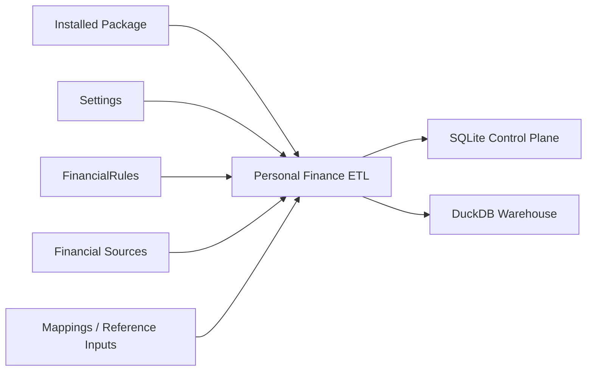

# Installation

Personal Finance ETL is a local-first Python application.

Installing the package gives you the software.

It does **not** automatically give you a compatible financial environment.

The current production system still expects source contracts, mappings, reference inputs, Settings, and FinancialRules compatible with the implementation.

---

## 1. Requirements

The project requires:

```text
Python 3.13+
```

The runtime is designed for a local workstation and uses embedded databases rather than external database servers.

Core technology ownership is:

| Technology | Responsibility |
| --- | --- |
| Python | Application/runtime |
| SQLite | Authoritative Control Plane and raw evidence |
| DuckDB | Analytical warehouse |
| Polars | Transformation/analytical dataframe execution |
| Pydantic | Settings and financial-policy validation |
| NumPy / Numba | FIRE simulation |
| Rich | CLI |
| CustomTkinter | Desktop application |
| Power BI | BI consumption |

---

## 2. Install from PyPI

```bash
pip install personal-finance-etl
```

Then launch the CLI:

```bash
shan-fin
```

or desktop application:

```bash
shan-fin-gui
```

The package includes the application documentation used by the docs browser.

---

## 3. Install for development

```bash
git clone https://github.com/tks18/personal-finance-etl.git
cd personal-finance-etl
pip install -e .
```

Use the repository's configured development dependencies/tooling for contribution work.

The project uses strict static-quality tooling including:

```text
Ruff
mypy
Pyright
```

Run the exact commands configured by the repository rather than maintaining a parallel local quality workflow.

---

## 4. What installation creates conceptually

Installation provides the application code.

A working financial environment provides the state it operates on.



The package alone cannot infer another person's financial semantics.

---

## 5. Runtime databases

A configured production run uses two embedded databases with different ownership.

### SQLite Control Plane

Owns:

```text
raw artifacts
raw payloads
sync state
runs
failures
Settings snapshots
FinancialRules snapshots
execution logs
```

### DuckDB

Owns:

```text
Bronze
Silver
Gold
lean Meta
```

No external database server is required for the current architecture.

---

## 6. Source environment

My production environment includes source families such as:

```text
stock broker snapshots
mutual-fund broker snapshots
historical transactions
market/reference files
masters and mappings
opening-state inputs
personal-finance SQLite data
```

As of **24 September 2026**, that environment contains **1,608 source artifacts** and grows by roughly **two broker snapshot files per day**.

That is context for the architecture, not a requirement that another deployment contain the same number of files.

---

## 7. Source compatibility

A source is not compatible merely because it is:

```text
CSV
Excel
SQLite
```

Compatibility depends on:

```text
physical format
expected columns
semantic meaning
mapping/reference rules
asset behaviour
tax assumptions
```

The current implementation is purpose-built around my source environment.

Another user should expect meaningful customization.

See [Adding a Data Source](../developer/adding-data-sources.md).

---

## 8. Local-first implications

The application is designed so core financial processing remains local.

That gives:

```text
financial evidence
+
analytical warehouse
+
simulation
+
application surfaces
```

one local execution environment.

This reduces operational infrastructure and keeps sensitive personal-finance data out of cloud dependencies by default.

It does not mean every external reference input is inherently offline; provider/API data can still be acquired and persisted as controlled evidence where configured.

---

## 9. Documentation is packaged too

The docs runtime follows:

```text
docs/*.md
→ manifest.json
→ DocsCatalog
→ DocsRenderer
→ CLI / Desktop
```

So installation includes the same versioned documentation structure used by the repository.

The application does not maintain a separate hard-coded guide list.

---

## 10. Before the first run

You need:

- valid operational Settings,
- valid FinancialRules,
- accessible source locations,
- required mapping/reference files,
- compatible source schemas,
- writable database/output locations.

Then continue to:

1. [Configuration](configuration.md)
2. [Running the Pipeline](running-the-pipeline.md)

---

## 11. What a successful installation does not prove

A successful:

```bash
pip install personal-finance-etl
```

proves that the package can be installed.

It does not prove:

```text
your source contracts match
your mappings are complete
your tax jurisdiction matches
your financial classifications match
your Power BI model matches
```

Those are deployment/model concerns.

The project roadmap aims to move more of that variation behind explicit adapters, strategies and configuration while preserving the current production behaviour.

---

## Troubleshooting direction

### Package imports fail

Verify:

```text
Python version
virtual environment
installed package/version
```

### Application starts but pipeline configuration fails

Inspect:

```text
Settings
FinancialRules
paths
reference inputs
```

### Pipeline starts but source ingestion fails

Inspect:

```text
source compatibility
artifact path
hash policy
extractor expectations
```

### Pipeline runs but financial output is unexpected

Do not start with the UI.

Trace:

```text
source evidence
→ Bronze
→ canonical state
→ analytical engine
→ Gold
```

and use the Control Plane/run logs for operational context.

---

## Next

- [Configuration](configuration.md)
- [Running the Pipeline](running-the-pipeline.md)
- [System Architecture](../architecture/system-architecture.md)

[← Getting Started Home](README.md) · [← Documentation Home](../README.md)
