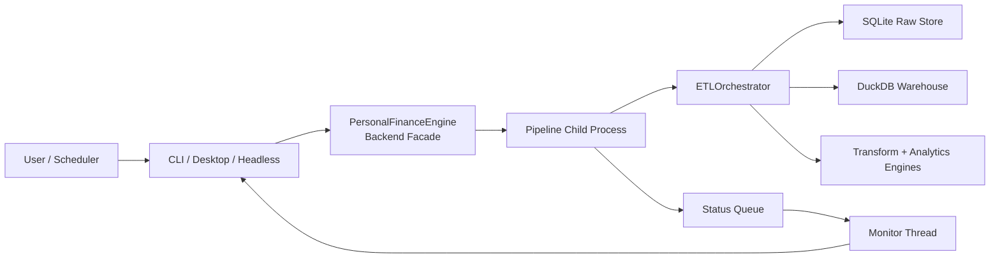
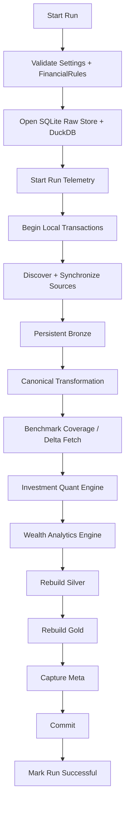

# Running the Pipeline

This guide covers the application surfaces and operational lifecycle used to run Personal Finance ETL.

The same backend financial engine can be reached through:

- the Rich CLI,
- the desktop application,
- automated/headless execution,
- and scheduled/cron-style workflows.

Power BI is a consumer of the resulting analytical warehouse rather than a pipeline execution surface.

---

## Before running

A successful run assumes:

- Python 3.13+ and the package are installed,
- operational configuration is valid,
- `FinancialRules` are valid,
- configured source/reference paths are accessible,
- and the source contracts are compatible with the current extractors.

If those conditions are not established yet, start with:

- [Installation](installation.md)
- [Configuration](configuration.md)
- [Financial Rules](../configuration/financial-rules.md)

---

## Application entry points

The package exposes:

```text
shan-fin
shan-fin-gui
```

### CLI

Start the terminal application with:

```bash
shan-fin
```

The CLI uses Rich for the interactive terminal experience.

### Desktop

Start the graphical application with:

```bash
shan-fin-gui
```

The GUI is a frontend over the same backend engine.

It does not implement a separate financial calculation path.

---

## Launcher capabilities

The current application launcher supports operational options around concepts such as:

```text
--config
--rules
--snapshot
--auto
--cron
--docs
```

These options allow the application to select configuration/rules, create snapshots, execute without the normal interactive path, support scheduled operation, and surface packaged documentation.

Exact CLI behaviour should always be checked against the installed version's help output because command-line interfaces can evolve.

Use:

```bash
shan-fin --help
```

as the authoritative runtime reference for available flags in the installed build.

---

## Runtime architecture

Interactive execution is separated from heavy pipeline work.



This keeps the frontend from owning the analytical lifecycle.

---

## Backend facade

`PersonalFinanceEngine` acts as the application-facing boundary.

It handles responsibilities around:

- configuration validation,
- financial-rules selection,
- recent configuration/rules state,
- snapshot operations,
- pipeline launch,
- and execution communication.

The frontend therefore asks the backend to run the system rather than directly orchestrating DuckDB, Polars, or financial engines.

---

## Child-process execution

Heavy ETL/analytics work runs in a child process.

This is particularly important for the desktop application.

Long-running workloads can include:

- Polars transformations,
- DuckDB loading,
- per-instrument investment processing,
- portfolio aggregation,
- and Numba Monte Carlo simulation.

Keeping those workloads outside the GUI event loop improves responsiveness and creates a cleaner failure boundary.

---

## Pipeline lifecycle

A normal successful run follows this broad lifecycle:



For the detailed state transitions, see [Data Lifecycle](../architecture/data-lifecycle.md).

---

## What happens during ingestion

The pipeline:

1. discovers configured source artifacts,
2. compares them with the Raw Store registry,
3. applies configured change/hash policy,
4. persists actionable raw bytes,
5. marks required artifacts `PENDING_BRONZE`,
6. extracts from persisted bytes,
7. synchronizes Bronze using the appropriate source strategy,
8. and marks successfully synchronized artifacts `SYNCED`.

Downstream transformation then operates from complete persistent Bronze state.

---

## What happens during analytics

After canonical transformation, the run can execute:

### Investment analytics

- asset-specific normalization,
- FIFO tax-lot reconstruction,
- broker reconciliation,
- benchmark shadow state,
- return/tax calculations,
- and hierarchical portfolio aggregation.

### Wealth analytics

- unified household ledger,
- asset-month balances,
- book/market/after-tax wealth,
- cash-flow reconciliation,
- budgets,
- tax forecasts,
- portfolio-management analytics,
- and FIRE.

The resulting state is published through Silver and Gold.

---

## Successful completion

A successful run ends only after the local persistence work completes.

Conceptually:

```text
Build analytical state
        ↓
Commit DuckDB
        ↓
Commit Raw Store
        ↓
Mark run successful
```

The transaction coordination is application-managed rather than distributed two-phase commit.

See [Reliability & Recovery](../architecture/reliability-and-recovery.md).

---

## Failure behaviour

If the pipeline raises an exception during the coordinated transaction scope, the intended lifecycle is:

```text
Exception
   ↓
Rollback DuckDB
   ↓
Rollback SQLite Raw transaction
   ↓
Record failed run telemetry
```

The existence of a failed run does not imply that all persisted raw evidence has been lost.

The Raw Store remains the upstream recovery boundary.

---

## CLI workflow

A typical interactive CLI workflow is:

```text
Launch
  ↓
Select / resolve configuration
  ↓
Select / resolve FinancialRules
  ↓
Run
  ↓
Observe progress
  ↓
Review completion / failure
  ↓
Consume DuckDB / Power BI outputs
```

The exact menus and prompts are application-version details.

This guide focuses on the stable operational model rather than duplicating every UI label.

---

## Desktop workflow

The desktop application provides a graphical surface over the backend.

The important architectural point is that the UI does not become the pipeline.

Conceptually:

```text
Desktop action
     ↓
Backend request
     ↓
Child-process pipeline
     ↓
Status messages
     ↓
Desktop progress / result
```

This separation allows the same financial engine to support both interactive and unattended execution.

---

## Automated / headless execution

The launcher supports non-interactive execution paths for automation and scheduling.

This is useful when I want the same configured pipeline to run without manually navigating the interactive UI.

A headless run still uses the same backend analytical lifecycle.

Automation does not imply a simplified calculation path.

---

## Scheduled / cron-style operation

Scheduled operation is useful when the source environment and configuration are stable enough for unattended execution.

Before scheduling, I recommend verifying:

- source paths are deterministic,
- configuration/rules paths are deterministic,
- no interactive source selection is required,
- local permissions are correct,
- and failure telemetry is being reviewed.

Automation should come after a reliable manual run, not before it.

---

## Snapshots

The application supports DuckDB snapshot workflows.

A snapshot protects a point-in-time analytical database state.

That is different from the Raw Store.

```text
Raw Store
→ protects source evidence / supports reconstruction

DuckDB snapshot
→ protects a point-in-time analytical warehouse
```

Both can be useful.

Neither replaces a proper local backup strategy.

---

## Documentation access

The package includes documentation access through the application surface.

The long-term direction is for the Markdown under `docs/` to remain the single maintained technical documentation source across:

- GitHub,
- packaged distribution,
- CLI,
- desktop,
- and the project Wiki.

This prevents application help text and repository documentation from becoming separate universes.

---

## Consuming the output

### Power BI

Power BI consumes the published analytical warehouse.

Gold is the primary decision-support layer, with Silver available where canonical detail is appropriate.

### DuckDB

The warehouse can also be queried directly for analytical exploration.

### CLI / Desktop

Application surfaces can expose execution state and selected analytical/application functions.

The important boundary is:

> **Pipeline execution creates analytical state; consumption reads that state.**

---

## Run telemetry

Meta captures operational context such as:

- run status,
- file registry state,
- output row counts,
- settings,
- and financial rules.

This helps answer:

```text
What ran?
What sources participated?
What was produced?
Under which settings?
Under which financial rules?
```

The current Meta layer is useful but is not yet a complete immutable historical lineage system.

---

## Re-running the pipeline

A re-run does not blindly append another copy of every source.

The ingestion lifecycle compares current sources with Raw state and synchronizes actionable changes.

Then downstream canonical/analytical state is rebuilt from complete Bronze state.

That means a run can be triggered for reasons including:

- new source artifacts,
- changed source artifacts,
- changed mappings/reference data,
- changed FinancialRules,
- changed analytical code,
- or intentional reconstruction.

---

## What configuration changes can do

Because Silver and Gold are rebuilt, changing rules can restate historical analytical outputs.

Examples include changing:

- income classification,
- expense semantics,
- asset classifications,
- tax parameters,
- target allocations,
- FIRE assumptions,
- or macro/planning assumptions.

This is expected.

The analytical warehouse represents current methodology applied to current upstream evidence.

---

## Operational checks after a run

After a successful run, useful checks include:

### Run status

Confirm the run is marked successful.

### Source synchronization

Unexpected pending artifacts can indicate incomplete Bronze synchronization.

### Row counts

Large unexpected changes can indicate source, mapping, or transformation issues.

### Cash-flow reconciliation

Review unreconciled cash movement where relevant.

### Investment reconciliation

Review instrument/broker mismatches or unexpected position adjustments.

### BI sanity

Validate that major household totals and investment positions align with expected current state.

A successful transaction commit is necessary, but financial plausibility still matters.

---

## Troubleshooting failed runs

### Failure during source discovery

Check:

- configured paths,
- permissions,
- expected files,
- and source categories.

### Failure during extraction

The source may not match the current extractor contract.

See [Adding a Data Source](../developer/adding-data-sources.md).

### Failure during Bronze synchronization

Check source lineage, table expectations, and whether the dataset follows reference-replacement or historical file-aware semantics.

### Failure during canonical transformation

Check mappings/reference inputs and financial semantic assumptions.

### Failure during investment analytics

Check:

- investment master identity,
- tax classification,
- purchase/sale history,
- market data,
- benchmark mapping/history,
- and broker reconciliation inputs.

### Failure during FIRE/planning

Verify that upstream wealth, spending, savings, macro context, and FinancialRules are valid before debugging the simulation itself.

---

## When not to automate

Do not schedule the pipeline merely because a cron option exists.

Keep execution manual while:

- source formats are still changing,
- mappings are unstable,
- reconciliation differences are unexplained,
- rules are under active redesign,
- or failures require interactive interpretation.

Automation is the final layer of a reliable workflow.

---

## Recovery after analytical database loss

If the DuckDB warehouse is recreated but the Raw Store survives, the system can return missing raw artifacts to the Bronze synchronization lifecycle and reconstruct downstream state.

Conceptually:

```text
Raw Store survives
      ↓
new DuckDB
      ↓
registry gap
      ↓
PENDING_BRONZE
      ↓
Bronze
      ↓
Silver
      ↓
Gold
```

See [Reliability & Recovery](../architecture/reliability-and-recovery.md) for the full caveats.

---

## Recommended operating sequence

For a new environment:

```text
Install
   ↓
Configure
   ↓
Validate FinancialRules
   ↓
Run manually
   ↓
Reconcile outputs
   ↓
Stabilize source contracts
   ↓
Create snapshot / backup practice
   ↓
Automate if useful
```

That order matters.

I would rather automate a boring reliable pipeline than schedule an exciting mystery. 😄

---

## Related documentation

- [Installation](installation.md)
- [Configuration](configuration.md)
- [Financial Rules](../configuration/financial-rules.md)
- [Data Lifecycle](../architecture/data-lifecycle.md)
- [Reliability & Recovery](../architecture/reliability-and-recovery.md)
- [Meta Data Contracts](../reference/meta-data-contracts.md)

[← Getting Started](README.md) · [← Documentation Home](../README.md)
