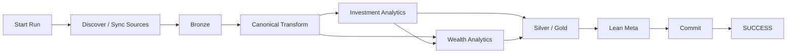

# Running the Pipeline

A production run is more than:

```text
read files
→ transform
→ save database
```

It is a tracked lifecycle across an authoritative SQLite Control Plane and a DuckDB analytical warehouse.



---

## 1. Launch options

### CLI

```bash
shan-fin
```

### Desktop

```bash
shan-fin-gui
```

The application also supports backend/headless execution paths used by automation.

The financial engine remains shared across surfaces.

---

## 2. Run lifecycle

A run is created in the Control Plane before the main analytical transaction.

```python
run_id = cp.runs.start_run(
    cfg_json=self.cfg.model_dump_json(),
    rules_json=self.rules.model_dump_json() if self.rules else None,
)
```

The lifecycle is:

```text
STARTED
→ RUNNING
→ COMMITTING
→ SUCCESS
```

or:

```text
RUNNING / COMMITTING
→ FAILED
```

The run record carries configuration provenance and execution history.

---

## 3. Source discovery

The run discovers the configured source environment.

Some inputs come from statement-folder discovery:

```python
discovered_files = categorize_statement_files(
    self.cfg.STATEMENTS_FOLDER,
    strict=True,
)
```

Others are explicit configured sources:

```python
discovered_files["opening_balances"] = [
    self.cfg.OPENING_BALANCE_CSV_PATH
]
```

Discovery does not mean every artifact is reparsed.

---

## 4. Change-aware synchronization

The Control Plane compares discovered state with its registry:

```python
new_files, changed_files, _ = cp.file_sync.sync_with_disk(
    discovered_files,
    self.cfg.FILE_HASH_POLICY,
    full_replace_categories,
)
```

Only:

```text
new
+
changed
```

artifacts become actionable.

This matters in the current production environment, which contained **1,608 source artifacts as of 24 September 2026** and grows by roughly **two broker snapshot files per day**.

---

## 5. Raw evidence is persisted

Actionable source bytes are stored in the SQLite Control Plane.

The artifact state becomes:

```text
PENDING_BRONZE
```

until successful Bronze synchronization.

This means the run has durable evidence before derived analytical state is complete.

---

## 6. Bronze synchronization

Historical/event sources use file-aware replacement.

Reference/current-state sources can use full replacement.

After successful Bronze persistence:

```text
PENDING_BRONZE
→ SYNCED
```

The run then reads complete Bronze state.

---

## 7. Canonical transformation

Complete Bronze enters the Polars transformation DAG.

```text
source-shaped state
      ↓
canonical financial contracts
```

Downstream engines should no longer need to understand source worksheets/provider labels.

---

## 8. Investment analytics

The investment engine reconstructs:

```text
FIFO lots
realized/unrealized state
holding classification
broker reconciliation
shadow benchmark
tax-aware values
XIRR
After-Tax XIRR
benchmark returns
drawdown
hierarchical analytics
```

Per-ISIN work can run in parallel.

A failed ISIN is fatal to the investment stage rather than silently omitted.

---

## 9. Wealth and planning analytics

The wealth/presentation engine reconstructs:

```text
household ledger
book wealth
market wealth
after-tax wealth
cash-flow reconciliation
budget/tax planning
portfolio-management view
FIRE
```

Independent LazyFrame outputs can be collected together:

```python
results = pl.collect_all(
    lazy_frames,
    engine="streaming",
)
```

---

## 10. Silver and Gold publication

The current system publishes:

```text
20 Silver contracts
17 Gold marts
```

Publication is driven by `DATA_CONTRACT_REGISTRY`.

Conceptually:

```python
contracts = sorted(
    (c for c in DATA_CONTRACT_REGISTRY if c.layer == "gold"),
    key=lambda c: c.publication_order,
)
```

This keeps physical identity, grain, producer and order explicit.

---

## 11. Meta publication

DuckDB Meta receives current analytical context:

```text
m_File_Registry
m_Table_Row_Counts
m_Financial_Rules
m_Settings
```

Historical run state remains in SQLite.

Meta is not the authoritative run log.

---

## 12. Commit

Once analytical publication is ready:

```python
cp.runs.update_run_status(
    run_id,
    "COMMITTING",
)

self.db_manager.conn.execute("COMMIT")
cp.commit()

cp.runs.finish_run(
    run_id,
    "SUCCESS",
)
```

The databases are coordinated by the application.

This is not distributed two-phase commit.

---

## 13. Failure behaviour

On failure, the orchestrator rolls back analytical work:

```python
self.db_manager.conn.execute("ROLLBACK")
cp.rollback()
```

Then persists structured failure state and closes the run as failed.

```text
failed run
≠ vanished run
```

The complete execution log is also attached to run history.

---

## 14. Reading a failed run

Start with the Control Plane.

Useful run context includes:

```text
run_id
status
started / finished time
application version
schema version
Settings snapshot
FinancialRules snapshot
failure stage
failed ISIN where relevant
error type
error message
traceback
execution log
```

That should usually tell you whether the problem belongs to:

```text
source ingestion
canonical transformation
investment analytics
wealth/planning
persistence
```

---

## 15. Do not debug from Gold backward by guesswork

Use the lineage of responsibilities:

```text
Raw Evidence
→ Bronze
→ Canonical
→ Engine
→ Silver / Gold
```

For example:

### Wrong source count

Inspect:

```text
Control Plane registry
hash/change classification
Bronze synchronization
```

### Wrong investment value

Inspect:

```text
canonical transactions
market data
FIFO/reconciliation state
lot analytics
```

### Wrong cash flow

Inspect:

```text
canonical income/expense/transfer
FinancialRules classifications
cash pool
reconciliation
```

### Wrong FIRE output

Inspect upstream state first:

```text
wealth
core spending
savings
FinancialRules
```

before blaming Monte Carlo.

---

## 16. Current production runtime context

On my current production environment:

```text
1,608 source artifacts
~2 additional broker snapshots/day
```

the hardened end-to-end pipeline currently runs at roughly:

```text
~14–17 seconds
```

compared with approximately:

```text
~23 seconds
```

before the production-hardening cycle.

Those numbers are environment-specific.

They are not universal package benchmarks.

The architectural reasons matter more:

```text
change-aware synchronization
persistent Bronze
Polars lazy/vectorized execution
parallel per-ISIN work
removed unused analytical processing
```

---

## 17. Output validation

After meaningful refactoring or configuration changes, validate:

```text
Silver row counts
Gold row counts
investment positions
FIFO/tax state
household net worth
cash-flow reconciliation
FIRE outputs
Power BI consumption
```

For infrastructure-only refactors, financial-output equivalence is the target.

For intentional methodology changes, document and explain the expected differences.

---

## 18. Documentation browser

The CLI/desktop docs surface uses the same packaged Markdown tree as the repository:

```text
manifest.json
→ DocsCatalog
→ DocsRenderer
```

So the application can be used to browse operational, architecture, finance and developer guidance without maintaining a second help system.

---

## 19. Snapshots and backup boundary

The current snapshot utility protects the DuckDB analytical database.

Because SQLite now owns authoritative operational history, the stronger future backup model is a coordinated bundle containing:

```text
DuckDB warehouse
+
SQLite Control Plane
```

Do not interpret a DuckDB-only snapshot as a complete backup of all operational provenance.

---

## 20. Successful run checklist

A healthy production run should leave:

- Control Plane run status = `SUCCESS`,
- actionable artifacts synchronized,
- complete Bronze state available,
- Silver rebuilt,
- Gold rebuilt,
- Meta refreshed,
- financial outputs reconciled,
- execution log persisted.

---

## Next

- [Data Lifecycle](../architecture/data-lifecycle.md)
- [Reliability & Recovery](../architecture/reliability-and-recovery.md)
- [Financial Model](../finance/financial-model.md)
- [Developer Guide](../developer/development-guide.md)

[← Getting Started Home](README.md) · [← Documentation Home](../README.md)
