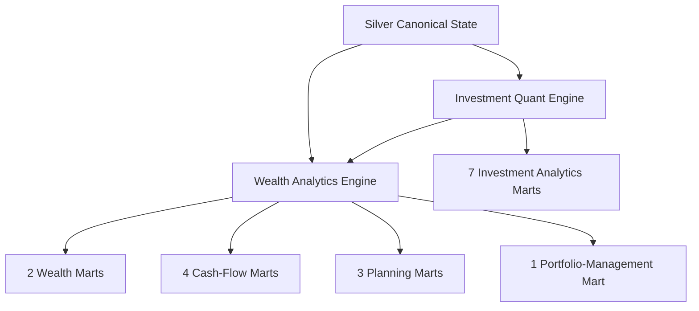

# Gold Data Contracts

Gold is the **decision-support serving layer** of Personal Finance ETL.

The current v6 architecture publishes **17 physical Gold marts** across five domains:

```text
Wealth                  2
Cash Flow               4
Planning                3
Portfolio Management    1
Investment Analytics    7
                       ──
                       17
```

Gold is intentionally multi-grain.

The marts are not denormalized copies of one universal fact table. Each exists because a specific analytical question requires a specific row meaning.

> **A calculation existing in code does not automatically make it a Gold metric. Gold is the curated product contract.**

---

## Gold catalog

| Domain | Contract | Grain |
| --- | --- | --- |
| Wealth | `Core_Monthly_Fact` | Month |
| Wealth | `Wealth_Asset_Breakdown` | Month × Asset |
| Cash Flow | `Cashflow_Expense_Breakdown` | Month × Expense Category |
| Cash Flow | `Cashflow_Income_Breakdown` | Month × Income Category |
| Cash Flow | `Cashflow_Efficiency_Analytics` | Month |
| Cash Flow | `Cashflow_Activity_Summary` | Month |
| Planning | `Wealth_FIRE_Analytics` | Month |
| Planning | `Forecast_Tax_Liability` | Month / planning context |
| Planning | `Forecast_Budget_Variance` | Month / budget context |
| Portfolio Management | `Investment_Portfolio_Summary` | Month × ISIN |
| Investment Analytics | `Investment_By_ISIN` | Date × ISIN |
| Investment Analytics | `Investment_By_Subtype` | Date × Subtype |
| Investment Analytics | `Investment_By_Class` | Date × Class |
| Investment Analytics | `Investment_By_Instrument_Type` | Date × Instrument Type |
| Investment Analytics | `Investment_By_Sector` | Date × Sector |
| Investment Analytics | `Investment_By_Industry` | Date × Industry |
| Investment Analytics | `Investment_By_Portfolio` | Date |

---

## Wealth domain

## `Core_Monthly_Fact`

**Purpose**  
Provide the primary household-level monthly analytical state for BI and planning.

**Domain**  
Wealth.

**Grain**  
One row per month.

**Producer**  
Wealth Analytics / presentation engine.

**Major inputs**

- canonical household transactions,
- reconstructed asset balances,
- investment market/tax state,
- liabilities,
- macro/inflation context,
- FinancialRules.

**Important measure families**

### Income

- total income,
- cash income,
- non-cash income,
- active/passive income context.

### Expenses

- total expense,
- cash expense,
- non-cash expense,
- core expense.

### Cash flow and savings

- net cash flow,
- savings,
- savings-rate context.

### Assets and investments

- asset balances,
- investment book value,
- investment market value,
- liquid/illiquid state.

### Wealth

- book net worth,
- market net worth,
- after-tax context where applicable.

### Macro

- CPI/inflation context.

**Downstream consumers**

Power BI household dashboards and planning analytics.

**Caveats**

This is a household-month state vector. Do not join a lower-grain mart directly without respecting grain and relationship semantics.

---

## `Wealth_Asset_Breakdown`

**Purpose**  
Provide asset-level drill-down beneath monthly household wealth.

**Domain**  
Wealth.

**Grain**  
Month × Asset.

**Major inputs**

Unified ledger and reconstructed asset-month state, plus investment market overlay.

**Important concepts**

- opening balance,
- closing book balance,
- market balance,
- net movement,
- income/expense effects,
- transfers,
- savings contribution,
- organic growth,
- liquidity context,
- runway-related context.

**Downstream consumers**

Power BI asset analysis and wealth attribution.

**Caveats**

A balance is point-in-time/semi-additive across time. Do not sum monthly balances across months as though they were flows.

---

## Cash-flow domain

## `Cashflow_Expense_Breakdown`

**Purpose**  
Explain where household spending occurred.

**Grain**  
Month × expense category context.

**Major inputs**

Canonical expense facts and FinancialRules.

**Important concepts**

- category/subcategory,
- total spend,
- cash spend,
- non-cash spend,
- trailing/YTD spending context.

**Downstream consumers**

Expense analysis, budget/planning, FIRE spending interpretation.

**Caveats**

Core/non-core and cash/non-cash semantics depend on policy.

---

## `Cashflow_Income_Breakdown`

**Purpose**  
Explain where household income originated and what kind of income it represents.

**Grain**  
Month × income category context.

**Important concepts**

- total income,
- cash income,
- active income,
- dividend income,
- interest income,
- non-cash income.

**Downstream consumers**

Income analysis, savings, tax forecasting, FIRE context.

---

## `Cashflow_Efficiency_Analytics`

**Purpose**  
Summarize how effectively household income is converted into savings, investment, liquidity, and wealth.

**Grain**  
Month.

**Important concepts**

- savings rate,
- investment rate,
- income/expense mix,
- liquidity ratio,
- debt-to-assets,
- emergency-fund coverage,
- nominal/real wealth-growth context.

**Caveats**

Ratios depend on the configured financial definitions behind their numerators and denominators.

---

## `Cashflow_Activity_Summary`

**Purpose**  
Reconcile classified cash activity with observed cash-pool movement.

**Grain**  
Month.

**Major inputs**

- configured cash pools,
- household ledger,
- operating/investing/financing classifications,
- internal transfers.

**Important concepts**

- opening cash,
- closing cash,
- actual net cash movement,
- operating inflow/outflow,
- investing inflow/outflow,
- financing inflow/outflow,
- internal transfers,
- calculated net cash flow,
- unreconciled difference.

**Interpretation**

This is a **reconciliation mart**, not merely a spending summary.

**Caveats**

A non-zero unreconciled difference is a financial-quality signal and should remain visible.

---

## Planning domain

## `Wealth_FIRE_Analytics`

**Purpose**  
Publish current-state, deterministic, and selected stochastic FIRE/planning outputs.

**Grain**  
Month.

**Major inputs**

- after-tax market wealth,
- trailing spending,
- trailing savings,
- macro assumptions,
- FIRE/Monte Carlo FinancialRules.

**Important concepts**

### Current / deterministic

- trailing spending,
- trailing savings,
- assumed real return,
- Target FI,
- Lean FI,
- Coast FI,
- future nominal target,
- FI coverage,
- FI gap,
- FI gap trend,
- linear months to FI,
- current withdrawal rate,
- required savings rate,
- actual savings rate,
- FI velocity,
- wealth velocity/acceleration,
- real multi-year net-worth CAGR.

### Stochastic

- P10 months to FI,
- P50 months to FI,
- P90 months to FI,
- modelled probability of success,
- projected P50 FI date,
- base/P50 runway,
- stressed/P10 runway,
- P50 nominal terminal wealth.

**Caveats**

These stochastic values are scenario outputs under configured assumptions, not predictions.

---

## `Forecast_Tax_Liability`

**Purpose**  
Publish household tax-planning context from investment realized state and other taxable income.

**Grain**  
Month / relevant planning-period context.

**Major inputs**

- realized investment tax state,
- taxable dividends,
- taxable interest,
- tax FinancialRules,
- exemption state.

**Important concepts**

- realized STCG,
- realized LTCG,
- realized gains,
- realized STCL,
- realized LTCL,
- realized losses,
- realized net P&L,
- taxable dividends,
- taxable interest,
- LTCG exemption used,
- LTCG exemption remaining,
- projected tax bill,
- effective tax rate,
- harvesting offset remaining,
- tax harvesting capacity.

**Caveats**

This is a planning estimate, not statutory tax filing output.

---

## `Forecast_Budget_Variance`

**Purpose**  
Publish budget/planning variance based on configured household allocation policy and analytical history.

**Grain**  
Month / budget context.

**Major inputs**

Household income/expense history, FinancialRules budget allocations, and rolling analytical state.

**Important concepts**

Budget amount, actual/forecast spending, variance, and related planning context according to the physical implementation.

**Caveats**

The builder can compute richer intermediate statistics than the Gold contract exposes. The physical mart is intentionally curated.

---

## Portfolio-management domain

## `Investment_Portfolio_Summary`

**Purpose**  
Publish action-oriented portfolio allocation and tax-management context.

**Domain**  
Portfolio Management.

**Grain**  
Month × ISIN.

**Major inputs**

Investment analytical state, current values, instrument classifications, target allocations, tax-aware lot state.

**Important concepts**

- current value,
- portfolio weight,
- class weight,
- target weight,
- allocation drift,
- rebalance flag,
- sector weight,
- harvestable loss,
- harvesting priority.

**Caveats**

During the v6 audit, rebalance tolerance remained approximately 5 percentage points in code rather than fully configurable.

The historically named monthly-return field is closer to market-value percentage change than a fully cash-flow-adjusted return. XIRR remains the stronger cash-flow-aware performance measure.

---

## Investment analytics domain

The seven investment marts share a common analytical family but operate at different grains.


This diagram shows the analytical roll-up idea. Some classifications are parallel portfolio views rather than a strict natural hierarchy in every semantic sense.

---

## Common investment measure families

Depending on grain, marts can expose:

- invested value,
- current value,
- quantity,
- unrealized P&L,
- absolute return,
- portfolio weight,
- CAGR,
- XIRR,
- after-tax XIRR,
- benchmark CAGR,
- benchmark XIRR,
- active return,
- benchmark-lag state,
- max drawdown,
- realized LTCG/STCG/gain,
- realized LTCL/STCL/loss,
- unrealized LTCG/STCG/gain,
- unrealized LTCL/STCL/loss,
- estimated tax if sold,
- and related tax-aware state.

Not every field is meaningful at every grain.

---

## `Investment_By_ISIN`

**Purpose**  
Publish security-level investment performance and tax state.

**Grain**  
Date × ISIN.

**Producer**  
Investment Quant Engine post-processing.

**Major inputs**

Silver lot analytics and portfolio cash-flow context.

**Important concepts**

The broadest security-level set of investment performance, benchmark, risk, and tax measures.

**Caveat: outperformance naming**

The current `Outperformance_Probability` field is closer to a ratio of active lots currently outperforming their benchmark CAGR than a stochastic probability forecast.

Interpret methodology, not the label.

---

## `Investment_By_Subtype`

**Purpose**  
Publish investment analytics grouped by configured instrument subtype.

**Grain**  
Date × Subtype.

**Methodology note**

Additive state can be aggregated, while cash-flow-aware return metrics must be recomputed at subtype grain.

---

## `Investment_By_Class`

**Purpose**  
Publish analytics by configured investment class.

**Grain**  
Date × Class.

**Use**

Asset-class performance and tax-aware portfolio analysis.

---

## `Investment_By_Instrument_Type`

**Purpose**  
Publish analytics by instrument-type classification.

**Grain**  
Date × Instrument Type.

---

## `Investment_By_Sector`

**Purpose**  
Publish investment analytics by sector.

**Grain**  
Date × Sector.

**Caveats**

Sector classification is more meaningful for some asset types than others.

Do not infer economic precision merely because every instrument has a populated label.

---

## `Investment_By_Industry`

**Purpose**  
Publish investment analytics by industry.

**Grain**  
Date × Industry.

---

## `Investment_By_Portfolio`

**Purpose**  
Publish total portfolio investment analytics.

**Grain**  
Date.

**Methodology**

Portfolio return measures are calculated from portfolio-level dated cash-flow context.

Conceptually:

```text
Portfolio XIRR
≠ average(ISIN XIRR)
```

**Important concepts**

- total invested/current value,
- total unrealized/realized state,
- portfolio XIRR,
- portfolio after-tax XIRR,
- portfolio benchmark XIRR,
- active return,
- drawdown,
- and tax-aware portfolio state.

---

## Gold producer map



The investment engine feeds household wealth as well as investment marts.

That keeps the financial lineage connected.

---

## Gold aggregation rules

## Additive measures

Can often be summed across compatible dimensions.

Examples:

- income,
- expense,
- current value,
- realized gain/loss.

## Semi-additive measures

Balances can often aggregate across assets but not across time.

## Non-additive measures

Require explicit methodology.

Examples:

- XIRR,
- CAGR,
- max drawdown,
- allocation weight,
- rates/ratios.

Gold contracts should never imply that all numeric columns are safely summable.

---

## Observed versus modelled fields

Gold contains several semantic types.

### Observed / reconstructed

Examples:

- income,
- expense,
- current market value,
- cash balances.

### Derived analytical

Examples:

- XIRR,
- active return,
- savings rate,
- allocation drift.

### Modelled planning

Examples:

- projected tax bill,
- estimated tax if sold,
- FI timing percentiles,
- probability of success,
- terminal wealth.

These categories should remain distinguishable in interpretation.

---

## Gold publication rules

1. **A mart has a business question.**
2. **A mart has an explicit grain.**
3. **A physical field has a defined financial meaning.**
4. **Non-additive measures use target-grain methodology.**
5. **Observed and modelled values are not conflated.**
6. **Intermediate calculations do not automatically become Gold.**
7. **Power BI should consume the published semantics rather than reinvent them.**

---

## Related documentation

- [Warehouse Architecture](../architecture/warehouse-architecture.md)
- [Data Model](../architecture/data-model.md)
- [Metrics & Methodology](../finance/metrics-and-methodology.md)
- [Investment Analytics](../finance/investment-analytics.md)
- [Cash Flow & Wealth](../finance/cashflow-and-wealth.md)
- [FIRE Methodology](../finance/fire-methodology.md)

[← Reference Home](README.md) · [← Documentation Home](../README.md)
