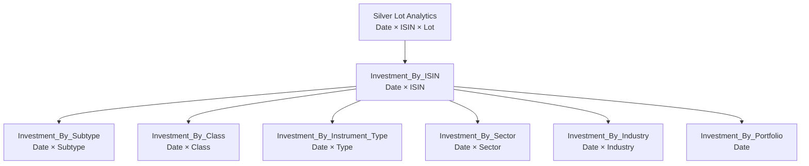

# Gold Data Contracts

Gold is the decision-support serving layer.

A Gold mart exists because a recurring analytical question deserves a stable physical contract.

The current architecture publishes **17 Gold marts** across five domains.

```text
Wealth                  2
Cash Flow               4
Planning                3
Portfolio Management    1
Investment Analytics    7
                       ──
                       17
```

Gold is deliberately multi-grain.

---

## Contract registry

A Gold contract is explicit before it is persisted:

```python
DataContract(
    contract_id="df_f_investment_analytics_isin",
    layer="gold",
    physical_table="gold.Investment_By_ISIN",
    domain="Investments",
    grain="Date-ISIN",
    producer="InvestmentQuantEngine",
    publication_order=200,
)
```

The contract answers:

```text
What in-memory output is this?
Where is it stored?
What domain owns it?
What does one row mean?
Who produces it?
When is it published?
```

---

## Publication

The hardened Gold loader uses the registry:

```python
contracts = sorted(
    (c for c in DATA_CONTRACT_REGISTRY if c.layer == "gold"),
    key=lambda c: c.publication_order,
)

for contract in contracts:
    if contract.contract_id in dfs:
        self._write(
            dfs[contract.contract_id],
            contract.physical_table,
        )
```

The registry is therefore executable metadata, not documentation-only metadata.

---

## Gold catalog

| Physical table | Domain | Grain | Producer |
| --- | --- | --- | --- |
| `gold.Core_Monthly_Fact` | Wealth | Month | WealthPresentationEngine |
| `gold.Wealth_Asset_Breakdown` | Wealth | Month × Asset | WealthPresentationEngine |
| `gold.Cashflow_Expense_Breakdown` | Cash Flow | Month × Expense Category | WealthPresentationEngine |
| `gold.Cashflow_Income_Breakdown` | Cash Flow | Month × Income Category | WealthPresentationEngine |
| `gold.Cashflow_Efficiency_Analytics` | Cash Flow | Month | WealthPresentationEngine |
| `gold.Cashflow_Activity_Summary` | Cash Flow | Month | WealthPresentationEngine |
| `gold.Wealth_FIRE_Analytics` | Planning | Month | WealthPresentationEngine |
| `gold.Forecast_Tax_Liability` | Planning | Month / planning context | WealthPresentationEngine |
| `gold.Forecast_Budget_Variance` | Planning | Month / budget context | WealthPresentationEngine |
| `gold.Investment_Portfolio_Summary` | Portfolio Management | Month × ISIN | WealthPresentationEngine |
| `gold.Investment_By_ISIN` | Investment Analytics | Date × ISIN | InvestmentQuantEngine |
| `gold.Investment_By_Subtype` | Investment Analytics | Date × Subtype | InvestmentQuantEngine |
| `gold.Investment_By_Class` | Investment Analytics | Date × Class | InvestmentQuantEngine |
| `gold.Investment_By_Instrument_Type` | Investment Analytics | Date × Instrument Type | InvestmentQuantEngine |
| `gold.Investment_By_Sector` | Investment Analytics | Date × Sector | InvestmentQuantEngine |
| `gold.Investment_By_Industry` | Investment Analytics | Date × Industry | InvestmentQuantEngine |
| `gold.Investment_By_Portfolio` | Investment Analytics | Date | InvestmentQuantEngine |

---

## Wealth domain

## `Core_Monthly_Fact`

**Grain:** Month.

**Purpose:** central household monthly state.

This mart can bring together decision-level measures around:

```text
income
expense
savings
wealth
liquidity
```

at a stable monthly grain.

### Additivity

Individual flow measures can be additive within the month.

Balance/ratio measures should not be summed across months.

---

## `Wealth_Asset_Breakdown`

**Grain:** Month × Asset.

**Purpose:** show reconstructed wealth by asset through time.

This grain was made explicit in the hardened `DataContract` registry.

```text
Month
  └── Asset
       └── book / market / planning state
```

It supports asset-level wealth composition without forcing the central monthly fact to duplicate one row per asset.

---

## Cash-flow domain

## `Cashflow_Expense_Breakdown`

**Grain:** Month × Expense Category.

**Purpose:** decision-oriented monthly expense composition.

The mart consumes canonical expense semantics rather than raw source labels.

FinancialRules can influence cash/non-cash and core/non-core interpretation upstream.

---

## `Cashflow_Income_Breakdown`

**Grain:** Month × Income Category.

**Purpose:** monthly income-stream composition.

The contract is useful for:

```text
income mix
active/passive stream analysis
planning inputs
```

without requiring consumers to reclassify transaction descriptions.

---

## `Cashflow_Efficiency_Analytics`

**Grain:** Month.

**Purpose:** monthly household cash-flow efficiency/savings-style analytics.

Non-additive rates should be interpreted at the published month grain.

They should not be summed across time.

---

## `Cashflow_Activity_Summary`

**Grain:** Month.

**Purpose:** reconcile classified cash activity with actual cash-pool movement.

Conceptually:

```text
Opening Cash
+ Operating
+ Investing
+ Financing
+ Transfer Treatment
=
Calculated Closing Cash
```

Then:

```text
Unreconciled Difference
= Actual Closing Cash - Calculated Closing Cash
```

The difference remains visible as a financial/data-quality signal.

---

## Planning domain

## `Wealth_FIRE_Analytics`

**Grain:** Month.

**Purpose:** expose selected deterministic and stochastic planning outputs.

Examples include:

```text
FI target / gap context
P10 / P50 / P90 months to FI
modelled probability of success
projected P50 FI date
base / stressed runway
P50 nominal terminal wealth
```

These are scenario outputs under configured assumptions.

They are not predictions.

---

## `Forecast_Tax_Liability`

**Grain:** Month / planning context.

**Purpose:** expose tax-planning state derived from the current financial model.

The exact tax treatment remains tied to configured/reference methodology.

This is planning output, not tax advice or an observed payable amount.

---

## `Forecast_Budget_Variance`

**Grain:** Month / budget context.

**Purpose:** compare planned/budget state with reconstructed financial activity.

The contract belongs in Gold because it answers a recurring management/planning question rather than representing canonical transaction evidence.

---

## Portfolio-management domain

## `Investment_Portfolio_Summary`

**Grain:** Month × ISIN.

**Producer:** `WealthPresentationEngine`.

This distinction matters.

The deep investment engine produces date-grain analytical state.

The presentation engine converts that state into a monthly management contract.

Important descriptive context includes:

```text
ISIN
instrument name
class
type
subtype
sector
industry
```

The hardened builder explicitly carries `INSTRUMENT_SUBTYPE` into the final output so the physical DDL and builder contract agree.

### Management semantics

The mart can expose:

```text
market value
actual allocation
target allocation
allocation drift
rebalance state
```

Rebalance tolerance comes from `FinancialRules`.

---

## Investment-analytics domain

The seven investment marts form a hierarchy.



The child marts are not produced by averaging every metric from ISIN grain.

Non-additive metrics are reconstructed at target grain.

---

## `Investment_By_ISIN`

**Grain:** Date × ISIN.

**Producer:** `InvestmentQuantEngine`.

This is the core security-level analytical contract.

It can expose state such as:

```text
market value
cost basis
realized / unrealized state
estimated tax
after-tax value
CAGR
XIRR
After-Tax XIRR
Benchmark CAGR
Benchmark XIRR
Active Return
Max Drawdown
Outperforming Lot Ratio
```

Not every field is additive.

---

## `Investment_By_Subtype`

**Grain:** Date × Subtype.

**Purpose:** aggregate investment state across instrument subtypes.

Examples might include lower-level classifications within broader investment types/classes.

Return metrics must be reconstructed from subtype-level cash flows.

---

## `Investment_By_Class`

**Grain:** Date × Class.

**Purpose:** class-level portfolio analytics.

Examples:

```text
Equity
Debt
other configured classes
```

The exact taxonomy comes from canonical investment classification.

---

## `Investment_By_Instrument_Type`

**Grain:** Date × Instrument Type.

**Purpose:** compare broad instrument families while preserving target-grain return methodology.

---

## `Investment_By_Sector`

**Grain:** Date × Sector.

**Purpose:** sector exposure/performance analysis where sector classification exists.

Sector market values can aggregate.

Sector XIRR must be reconstructed.

---

## `Investment_By_Industry`

**Grain:** Date × Industry.

**Purpose:** lower-grain industry exposure/performance analysis.

As with sector, classification quality depends on the Investment Master.

---

## `Investment_By_Portfolio`

**Grain:** Date.

**Purpose:** whole-portfolio investment analytics.

This is where non-additivity becomes most important.

```text
Portfolio XIRR
≠ average(ISIN XIRR)

Portfolio Max Drawdown
≠ average(ISIN Max Drawdown)
```

Portfolio cash flows and value path must be reconstructed at portfolio grain.

---

## Important metric semantics

## `Outperforming_Lot_Ratio`

Descriptive ratio:

```text
Active Lots Outperforming Benchmark / Active Lots
```

It is not a probability forecast.

The older `Outperformance_Probability` name was removed because it overstated the methodology.

---

## `Monthly_Market_Value_Change_Pct`

Describes month-over-month market-value change.

It is not labelled as monthly investment return because capital flows can affect market value.

The older `ISIN_Monthly_Return` name was removed to avoid that ambiguity.

---

## Additivity

| Measure family | Typical behaviour |
| --- | --- |
| Income / expense | Additive within compatible grain |
| Market value | Additive across components at one date |
| Realized gain/loss | Additive where classifications align |
| Tax amount | Additive where methodology aligns |
| XIRR | Non-additive |
| CAGR | Non-additive |
| Max Drawdown | Non-additive |
| Weight | Non-additive |
| Rates / ratios | Usually non-additive |

The target mart must implement the correct aggregation methodology.

---

## Gold and Power BI

Gold should simplify the BI semantic model.

Python owns methodology that is:

```text
stateful
cash-flow aware
tax aware
simulation heavy
or difficult to express safely at BI query time
```

Power BI can then focus on:

```text
filtering
slicing
visual aggregation
presentation measures
decision dashboards
```

The boundary prevents DAX from becoming a second financial engine.

---

## Contract-change discipline

Changing Gold can affect:

```text
DataContract registry
builder output
DuckDB DDL
Meta row counts
Power BI
documentation
```

A Gold rename is therefore an interface change.

The semantic hardening from:

```text
Outperformance_Probability
→ Outperforming_Lot_Ratio

ISIN_Monthly_Return
→ Monthly_Market_Value_Change_Pct
```

is a good example: naming changes were required because the old contract invited incorrect interpretation.

---

## Gold design rules

1. Start from a decision question.
2. Define grain before schema.
3. Reuse Silver where a mart is unnecessary.
4. Recompute non-additive metrics at target grain.
5. Register every physical Gold contract.
6. Keep producer metadata accurate.
7. Keep builder output aligned with DDL.
8. Use intentional publication order.
9. Keep Meta row counts registry-driven.
10. Let Power BI consume financial methodology rather than reinvent it.

---

## Related documentation

- [Adding a Gold Mart](../developer/adding-gold-marts.md)
- [Investment Analytics](../finance/investment-analytics.md)
- [Metrics & Methodology](../finance/metrics-and-methodology.md)
- [Data Model](../architecture/data-model.md)
- [Silver Data Contracts](silver-data-contracts.md)

[← Reference Home](README.md) · [← Documentation Home](../README.md)
