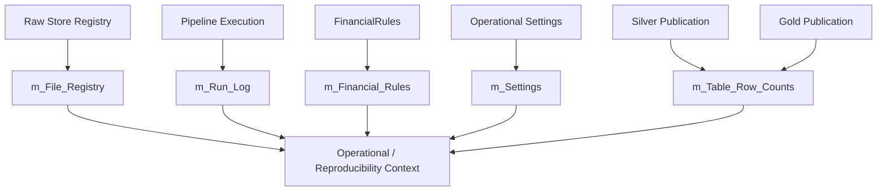

# Meta Data Contracts

Meta is the **operational and reproducibility context layer** of the analytical warehouse.

The current v6 architecture contains **5 Meta tables**:

```text
m_File_Registry
m_Run_Log
m_Table_Row_Counts
m_Financial_Rules
m_Settings
```

These tables do not represent household financial activity.

They describe the analytical system and the context under which it ran.

Conceptually, Meta answers:

```text
What entered?
What ran?
What was produced?
Under which financial rules?
Under which operational settings?
```

---

## Meta catalog

| Contract | Purpose | Conceptual grain |
| --- | --- | --- |
| `m_File_Registry` | Source participation / warehouse registry context | File / artifact |
| `m_Run_Log` | Pipeline execution telemetry | Run |
| `m_Table_Row_Counts` | Published dataset volume | Run × table |
| `m_Financial_Rules` | Financial-policy snapshot/context | Run / rules context |
| `m_Settings` | Operational settings snapshot/context | Run / settings context |

The exact physical columns should be interpreted from the live schema. This guide documents the stable conceptual contract.

---

## `m_File_Registry`

**Purpose**  
Represent source/artifact registry context inside the analytical warehouse.

**Conceptual grain**  
File / artifact identity.

**Relationship to Raw Store**

The authoritative ingestion synchronization state lives in the SQLite Raw Document Store.

The Meta registry provides warehouse-side operational context rather than replacing the Raw Store's control role.

**Important concepts**

- source identity,
- file/artifact name,
- category,
- ingestion/synchronization context,
- warehouse participation.

**Use**

Supports observability and comparison between Raw state and analytical warehouse state.

**Recovery relevance**

When the analytical warehouse is recreated, comparing surviving Raw registry state with warehouse-side registration helps identify artifacts that need to return to the Bronze synchronization path.

---

## `m_Run_Log`

**Purpose**  
Record pipeline execution telemetry.

**Conceptual grain**  
One row per run/execution context.

**Important concepts**

- run identity,
- start/end context,
- status,
- success/failure,
- duration or related telemetry where present,
- execution context.

**Reliability role**

Run telemetry is intentionally useful even when analytical work fails.

A failed run should remain observable rather than disappearing with a rollback.

**Caveat**

Meta run logging is operational telemetry, not a distributed observability platform.

---

## `m_Table_Row_Counts`

**Purpose**  
Record output row-count context for published datasets.

**Conceptual grain**  
Run × table/dataset.

**Use**

Useful for:

- sanity checks,
- detecting unexpectedly empty outputs,
- detecting large unexplained volume changes,
- and basic operational comparison between runs.

**Caveat**

Row count is not data quality by itself.

A table can have the expected number of rows and still be financially wrong.

---

## `m_Financial_Rules`

**Purpose**  
Capture the financial-policy context associated with analytical execution.

**Conceptual grain**  
Run / rules snapshot context.

**Important concepts**

Policy families can include:

- income semantics,
- expense semantics,
- asset semantics,
- cash-flow rules,
- target allocation,
- tax parameters,
- FIRE assumptions,
- and stochastic-model parameters.

**Why it matters**

Silver and Gold are rebuilt under current FinancialRules.

Therefore policy is part of analytical reproducibility.

**Current limitation**

The current Meta layer can be strengthened further with an explicit rules fingerprint/hash and schema version.

---

## `m_Settings`

**Purpose**  
Capture operational configuration context.

**Conceptual grain**  
Run / settings snapshot context.

**Important concepts**

Operational settings can include:

- source locations,
- persistence locations,
- reference/mapping paths,
- and ingestion policy.

**Why it matters**

A run is not fully understandable without knowing the environment in which it executed.

**Current limitation**

A future settings fingerprint/hash would make comparisons and historical reproducibility stronger.

---

## Meta relationship map



---

## Meta and reproducibility

A strong reproducibility question is:

> If I see an analytical result, can I identify the evidence, code/policy context, and output contract that produced it?

The current Meta layer provides part of that answer.

It captures:

- source participation,
- run execution,
- row counts,
- settings,
- and financial rules.

It does **not yet** provide a complete immutable historical build manifest.

---

## Future reproducibility fields

Natural future additions include:

```text
application_version
git_commit
schema_version
rules_schema_version
settings_hash
financial_rules_hash
data_contract_version
```

These would make it easier to distinguish:

```text
same raw evidence + new rules
```

from:

```text
same raw evidence + new code
```

from:

```text
new raw evidence
```

Those are future hardening opportunities, not current v6 guarantees.

---

## Meta and historical replay

Even with Raw persistence, re-running old evidence later can use different:

- application code,
- schemas,
- financial rules,
- or configuration.

Therefore:

```text
recoverability
≠
immutable historical replay
```

Meta version/fingerprint hardening would reduce that gap.

---

## Meta and row-count validation

Row counts can provide simple operational signals.

Examples:

```text
expected Gold mart suddenly has 0 rows
→ investigate

investment lot table drops dramatically
→ investigate source / reconciliation / processing

household monthly table unexpectedly doubles
→ investigate grain / duplication
```

But row counts should be paired with financial reconciliation and semantic checks.

---

## Meta and data-contract registry

During the architecture audit, one recurring opportunity emerged: a shared explicit data-contract registry.

Conceptually:

```yaml
Core_Monthly_Fact:
  layer: gold
  domain: wealth
  grain:
    - MONTH_START_DATE
  producer: WealthPresentationEngine
```

Such a registry could eventually support:

- physical publication mapping,
- Meta layer identity,
- row-count cataloging,
- schema validation,
- documentation generation,
- and application navigation.

This is future architecture.

The current implementation should not be documented as though this registry already exists.

---

## Current Meta caveat: layer inference

The v6 audit identified an architectural weakness where physical layer identity can be inferred from internal frame/dataset naming conventions.

That is less robust than explicit contract metadata.

A future improvement should make:

```text
physical layer
physical table
domain
producer
grain
```

explicit rather than inferred.

---

## Meta and sensitive information

Settings and FinancialRules can reveal sensitive information about my financial environment.

Meta should therefore be treated as part of the sensitive local analytical system.

Operational metadata is not automatically safe to publish merely because it does not contain individual bank transactions.

---

## Meta contract invariants

1. **Meta describes the analytical system, not household finance.**
2. **Raw Store remains authoritative for ingestion synchronization state.**
3. **Failed runs remain observable.**
4. **Row counts remain operational signals, not proof of correctness.**
5. **Financial rules remain part of reproducibility context.**
6. **Operational settings remain separate from financial policy.**
7. **Recoverability remains distinct from immutable historical replay.**
8. **Future version/fingerprint metadata should be explicit.**
9. **Layer/domain identity should move toward explicit contract metadata rather than naming inference.**
10. **Meta remains sensitive local data.**

---

## Related documentation

- [Reliability & Recovery](../architecture/reliability-and-recovery.md)
- [Warehouse Architecture](../architecture/warehouse-architecture.md)
- [Data Lifecycle](../architecture/data-lifecycle.md)
- [Financial Rules](../configuration/financial-rules.md)
- [Silver Data Contracts](silver-data-contracts.md)
- [Gold Data Contracts](gold-data-contracts.md)

[← Reference Home](README.md) · [← Documentation Home](../README.md)
