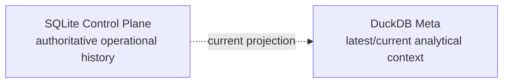
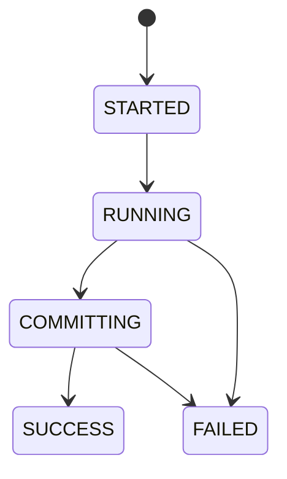

# Meta & Control-Plane Data Contracts

The current architecture has **two metadata surfaces with different ownership**.



This distinction is one of the major architectural changes in the hardened system.

> **Control Plane is authoritative. DuckDB Meta is a projection.**

---

## 1. SQLite Control Plane

The Control Plane owns:

```text
raw artifact registry
raw payload bytes
sync state
Settings snapshots
FinancialRules snapshots
run lifecycle
run failures
execution logs
```

It is not merely another warehouse schema.

It is operational state.

---

## `cp_file_registry`

**Purpose:** authoritative artifact identity and synchronization state.

Representative production DDL:

```sql
CREATE TABLE IF NOT EXISTS cp_file_registry (
    file_id TEXT PRIMARY KEY,
    file_name TEXT NOT NULL,
    relative_path TEXT NOT NULL UNIQUE,
    file_category TEXT NOT NULL,
    file_type TEXT,
    file_hash TEXT NOT NULL,
    file_size_bytes BIGINT,
    sync_status TEXT DEFAULT 'PENDING_BRONZE',
    first_ingested TIMESTAMP NOT NULL,
    last_ingested TIMESTAMP NOT NULL
);
```

### Key semantics

| Field | Meaning |
| --- | --- |
| `file_id` | Stable artifact identity derived by the application |
| `relative_path` | Canonical source/virtual identity |
| `file_category` | Source semantic category |
| `file_type` | Physical type used by ingestion policy |
| `file_hash` | Content identity |
| `sync_status` | Relationship to Bronze lifecycle |
| `first_ingested` | First Control Plane observation |
| `last_ingested` | Latest ingestion/update |

### Sync state

```text
PENDING_BRONZE
→ raw evidence exists but Bronze synchronization is incomplete

SYNCED
→ artifact has successfully reached Bronze
```

That state is operationally meaningful.

---

## `cp_file_payloads`

**Purpose:** durable raw evidence.

```sql
CREATE TABLE IF NOT EXISTS cp_file_payloads (
    file_id TEXT PRIMARY KEY,
    file_bytes BLOB,
    FOREIGN KEY(file_id)
        REFERENCES cp_file_registry(file_id)
        ON DELETE CASCADE
);
```

The payload is separate from registry metadata.

This allows the system to retain the actual source bytes rather than relying only on a filesystem path.

---

## Virtual artifacts

External/provider data can enter the same evidence model through virtual identity:

```text
virtual://<category>/<filename>
```

A virtual artifact still receives:

```text
file identity
content hash
payload
sync state
```

so API-acquired benchmark history does not bypass provenance.

---

## 2. Configuration snapshots

The Control Plane stores Settings and FinancialRules by content identity.

Conceptually:

```text
canonical serialized payload
        ↓
SHA-256
        ↓
snapshot_id
```

Production code follows this pattern:

```python
cfg_hash = hashlib.sha256(
    cfg_json.encode("utf-8")
).hexdigest()

settings_id = f"snap_set_{cfg_hash[:12]}"
```

Then:

```sql
INSERT OR IGNORE
```

avoids duplicate snapshots for identical content.

---

## Settings snapshot

**Purpose:** identify the operational configuration used by a run.

Examples of operational concerns:

```text
source paths
database paths
reference-file paths
hash policy
```

Settings are not financial policy.

---

## FinancialRules snapshot

**Purpose:** identify the financial policy used by a run.

Examples:

```text
income semantics
expense semantics
cash pools
tax assumptions
target allocation
FIRE assumptions
```

A rules snapshot is part of financial provenance.

---

## 3. `cp_runs`

**Purpose:** authoritative run lifecycle.

Representative structure:

```sql
CREATE TABLE IF NOT EXISTS cp_runs (
    run_id TEXT PRIMARY KEY,
    started_at TIMESTAMP NOT NULL,
    finished_at TIMESTAMP,
    status TEXT,
    application_version TEXT,
    schema_version TEXT,
    settings_snapshot_id TEXT,
    rules_snapshot_id TEXT,
    execution_log TEXT
);
```

The lifecycle is:



A run is created before analytical work so failure does not erase the fact that execution occurred.

---

## Run provenance

A run connects:

```text
run identity
application version
schema version
Settings snapshot
FinancialRules snapshot
execution log
status
timestamps
```

That is much stronger than a simple start/end log row.

---

## 4. `cp_run_failures`

**Purpose:** structured failure history.

Representative DDL:

```sql
CREATE TABLE IF NOT EXISTS cp_run_failures (
    id INTEGER PRIMARY KEY AUTOINCREMENT,
    run_id TEXT NOT NULL,
    failed_isin TEXT,
    stage TEXT,
    error_type TEXT,
    error_message TEXT,
    traceback_log TEXT,
    created_at TIMESTAMP NOT NULL
);
```

The contract supports both:

```text
pipeline-level failure
and
instrument-specific failure
```

For investment failures, `failed_isin` can preserve the instrument boundary that failed.

---

## Why failures are separate from run status

`cp_runs.status = FAILED` answers:

> Did the run fail?

`cp_run_failures` answers:

> What failed, where, and with what context?

Those are different operational questions.

---

## 5. Execution log

The complete execution log is persisted against the run.

Structured fields provide machine-queryable failure state.

The log preserves chronological context.

```text
structured failure
+
execution narrative
```

is more useful than either alone.

---

## 6. What the Control Plane does not yet model

The current Control Plane provides strong operational provenance.

It is not yet a complete normalized lineage graph.

There are no dedicated contracts equivalent to:

```text
cp_run_artifacts
cp_run_stages
cp_run_outputs
cp_lineage_edges
```

connecting every run/artifact/analytical contract.

Do not describe the current implementation as row-level or graph-complete lineage.

---

## 7. DuckDB Meta

DuckDB Meta is intentionally lean.

Current tables:

```text
m_File_Registry
m_Table_Row_Counts
m_Financial_Rules
m_Settings
```

It exists to put useful current-state context beside the analytical warehouse.

Historical operational truth stays in SQLite.

---

## `meta.m_File_Registry`

**Purpose:** current analytical projection of source registry state.

This is useful for warehouse/BI inspection.

It is not authoritative when it conflicts with the Control Plane.

The self-healing path uses SQLite to repair missing DuckDB registry state, not the reverse.

---

## `meta.m_Table_Row_Counts`

**Purpose:** current publication row-count telemetry.

Representative DDL:

```sql
CREATE TABLE IF NOT EXISTS meta.m_Table_Row_Counts (
    schema_name TEXT NOT NULL,
    table_name TEXT NOT NULL,
    row_count BIGINT,
    generated_at TIMESTAMP
);
```

The hardened implementation resolves layer/table identity through `DATA_CONTRACT_REGISTRY`.

Conceptually:

```python
contract_by_id = {
    contract.contract_id: contract
    for contract in DATA_CONTRACT_REGISTRY
}

contract = contract_by_id.get(contract_id)

physical_table = contract.physical_table.split(
    ".",
    maxsplit=1,
)[-1]
```

This replaces brittle inference from internal frame names.

---

## `meta.m_Financial_Rules`

**Purpose:** current financial-policy projection useful beside analytical state.

Historical FinancialRules provenance remains in Control Plane snapshots.

Think:

```text
SQLite
→ which rules did historical run X use?

DuckDB Meta
→ which rules describe the current analytical state?
```

---

## `meta.m_Settings`

**Purpose:** current operational-settings projection useful to analytical consumers.

Again:

```text
Control Plane
→ historical authority

Meta
→ current analytical context
```

---

## 8. Control Plane vs Meta query guide

| Question | Query surface |
| --- | --- |
| Which artifacts exist historically/currently? | Control Plane |
| What raw bytes were stored? | Control Plane |
| Which artifact is `PENDING_BRONZE`? | Control Plane |
| What runs occurred? | Control Plane |
| What failed in run X? | Control Plane |
| Which FinancialRules snapshot did run X use? | Control Plane |
| What is the latest warehouse file registry projection? | DuckDB Meta |
| How many rows were published to current Silver/Gold tables? | DuckDB Meta |
| What current rules/settings should BI inspect? | DuckDB Meta |

This table is the easiest way to avoid confusing the two surfaces.

---

## 9. Self-healing direction

If a Control Plane artifact is missing from DuckDB's registry, Meta can requeue it:

```python
cp.artifacts.db.conn.execute(
    """
    UPDATE cp_file_registry
    SET sync_status = 'PENDING_BRONZE'
    WHERE relative_path = ?
    """,
    [path],
)
```

The direction is:

```text
authoritative SQLite
        ↓
repair analytical DuckDB state
```

That direction should not be inverted.

---

## 10. Run/warehouse consistency boundary

SQLite and DuckDB use separate local transactions coordinated by the application.

So the metadata architecture should be understood with that limitation.

```text
DuckDB COMMIT
then
SQLite COMMIT
```

is not distributed 2PC.

The Control Plane is still the authoritative operational system, but there is a narrow theoretical cross-database failure window.

That trade-off is documented explicitly.

---

## 11. Recovery implications

If DuckDB is lost while SQLite survives:

```text
Control Plane evidence
        ↓
rebuild Bronze
        ↓
rebuild Silver
        ↓
rebuild Gold
```

If SQLite is lost while DuckDB survives, current analytics can remain available but authoritative raw/run provenance is gone.

That is why the stronger future backup model should snapshot both databases as one system bundle.

---

## 12. Metadata design rules

1. One system owns historical operational truth.
2. Raw evidence and payloads live with operational authority.
3. Run state is durable and explicit.
4. Configuration/rules are content-addressed.
5. Failures are structured and queryable.
6. Execution logs complement structured state.
7. DuckDB Meta remains lean.
8. Meta identity comes from explicit contracts where possible.
9. Recovery flows from Control Plane to analytical state.
10. Current provenance is strong but not graph-complete lineage.

---

## Related documentation

- [System Architecture](../architecture/system-architecture.md)
- [Data Lifecycle](../architecture/data-lifecycle.md)
- [Reliability & Recovery](../architecture/reliability-and-recovery.md)
- [Financial Rules](../configuration/financial-rules.md)

[← Reference Home](README.md) · [← Documentation Home](../README.md)
