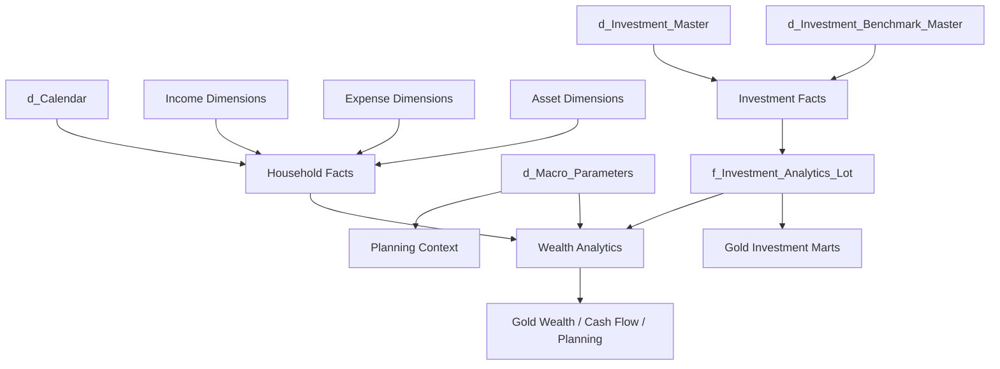

# Silver Data Contracts

Silver is the **canonical financial and analytical contract layer** of Personal Finance ETL.

The current v6 architecture publishes **20 physical Silver tables**:

```text
11 dimensions / reference models
9 facts
```

This guide is a contract reference rather than a methodology tutorial.

For each dataset, it documents:

```text
Purpose
Domain
Grain
Producer / origin
Major inputs
Important fields / concepts
Downstream consumers
Assumptions / caveats
```

For conceptual relationships, see [Data Model](../architecture/data-model.md).

> Silver is not merely cleaned Bronze. It is the boundary where source-specific structure has been converted into stable financial concepts.

---

## Contract catalog

### Dimensions and reference models

| Contract | Domain | Conceptual grain |
| --- | --- | --- |
| `d_Calendar` | Shared | Date |
| `d_Income_Category` | Household | Income category |
| `d_Income_Subcategory` | Household | Income subcategory |
| `d_Expense_Category` | Household | Expense category |
| `d_Expense_Subcategory` | Household | Expense subcategory |
| `d_Asset_Category` | Household | Asset category |
| `d_Asset_SubCategory` | Household | Asset subcategory |
| `d_Currency` | Shared | Currency |
| `d_Investment_Benchmark_Master` | Investment | Benchmark |
| `d_Investment_Master` | Investment | Instrument / ISIN |
| `d_Macro_Parameters` | Planning | Macro parameter context |

### Facts

| Contract | Domain | Conceptual grain |
| --- | --- | --- |
| `f_Income_Transactions` | Household | Income transaction |
| `f_Expense_Transactions` | Household | Expense transaction |
| `f_Transfer_Transactions` | Household | Transfer transaction |
| `f_Opening_Balances` | Household | Opening balance by asset/context |
| `f_Investment_Market_Data` | Investment | Date × instrument |
| `f_Investment_Purchase_Data` | Investment | Purchase transaction |
| `f_Investment_Sale_Data` | Investment | Sale transaction |
| `f_Investment_Benchmark_Data` | Investment | Date × benchmark |
| `f_Investment_Analytics_Lot` | Investment analytics | Date × ISIN × active tax lot |

---

## Shared dimensions

## `d_Calendar`

**Purpose**  
Provide one canonical time vocabulary for household, investment, tax, and planning analytics.

**Domain**  
Shared.

**Grain**  
One row per calendar date.

**Major concepts**

- date identity,
- month,
- year,
- financial/fiscal period context,
- month boundaries,
- reporting-period attributes.

**Downstream consumers**

- household facts,
- investment facts,
- Gold monthly marts,
- tax financial-year logic,
- FIRE/planning windows.

**Caveats**

Time semantics should be reused from the canonical calendar rather than independently recreated in each mart.

---

## `d_Currency`

**Purpose**  
Represent currency as an explicit canonical reference rather than an implicit source property.

**Domain**  
Shared.

**Grain**  
One row per canonical currency.

**Downstream consumers**

Household and financial facts requiring currency identity.

**Caveats**

The current platform is built around my financial environment and should not be interpreted as a fully generalized multi-currency valuation engine merely because currency is modelled explicitly.

---

## Household classification dimensions

## `d_Income_Category`

**Purpose**  
Canonical top-level classification of income.

**Grain**  
One row per income category.

**Major inputs**

Source mappings and canonical transformation.

**Downstream consumers**

- `f_Income_Transactions`,
- income breakdown marts,
- household monthly state,
- tax/planning analytics.

**Caveats**

FinancialRules can add semantic treatment such as active, dividend, interest, cash, or non-cash classification beyond the basic category identity.

---

## `d_Income_Subcategory`

**Purpose**  
Provide finer-grained income classification beneath the canonical category.

**Grain**  
One row per income subcategory.

**Relationship**

```text
Income Category
      ↓
Income Subcategory
```

**Downstream consumers**

Income transaction facts and category-level BI drill-down.

---

## `d_Expense_Category`

**Purpose**  
Canonical top-level classification of household expense.

**Grain**  
One row per expense category.

**Downstream consumers**

- expense transactions,
- expense breakdown,
- budget analytics,
- spending/FIRE models.

**Caveats**

Core/non-core and cash/non-cash treatment is financial policy, not merely category identity.

---

## `d_Expense_Subcategory`

**Purpose**  
Provide finer expense classification beneath the canonical category.

**Grain**  
One row per expense subcategory.

**Downstream consumers**

Expense facts and BI drill-down.

---

## Asset dimensions

## `d_Asset_Category`

**Purpose**  
Define top-level household balance-sheet asset classifications.

**Grain**  
One row per asset category.

**Downstream consumers**

- opening balances,
- transfers,
- wealth reconstruction,
- liquidity,
- cash-flow modelling.

---

## `d_Asset_SubCategory`

**Purpose**  
Provide finer asset classification beneath the top-level asset category.

**Grain**  
One row per asset subcategory.

**Caveats**

FinancialRules can assign additional semantics such as cash-pool, liquid/illiquid, or investment treatment.

---

## Investment reference dimensions

## `d_Investment_Benchmark_Master`

**Purpose**  
Define canonical benchmark identities used by the investment engine.

**Domain**  
Investment.

**Grain**  
One row per benchmark identity.

**Major inputs**

Benchmark master/reference inputs.

**Downstream consumers**

- instrument benchmark mapping,
- benchmark history,
- shadow benchmark construction,
- benchmark-relative analytics.

**Caveats**

Benchmark mapping is part of investment methodology. A technically valid benchmark identity is not automatically an economically appropriate benchmark.

---

## `d_Investment_Master`

**Purpose**  
Provide canonical investment-instrument identity and analytical classification.

**Domain**  
Investment.

**Grain**  
One row per instrument / ISIN-level identity.

**Major concepts**

- ISIN / stable instrument identity,
- instrument type,
- subtype,
- class,
- sector,
- industry,
- benchmark mapping,
- tax type.

**Major inputs**

Asset-pipeline outputs, mappings, and reference data.

**Downstream consumers**

- purchase/sale/market facts,
- FIFO engine,
- tax engine,
- hierarchical investment analytics,
- portfolio-management marts.

**Quality expectations**

The production load path treats critical investment identity and tax fields as required financial-contract data rather than harmless optional metadata.

**Caveats**

Some classifications are analytical views rather than a strict natural hierarchy for every instrument.

---

## Planning reference model

## `d_Macro_Parameters`

**Purpose**  
Persist macro/planning reference context used by household and FIRE analytics.

**Domain**  
Planning.

**Grain**  
Macro parameter context as defined by the physical contract.

**Major concepts**

Inflation and other configured/persisted macro context.

**Downstream consumers**

- household monthly analytics,
- tax assumptions where applicable,
- FIRE/planning models.

**Caveats**

Persisted macro context is distinct from stochastic simulation policy in `FinancialRules`.

---

## Household facts

## `f_Income_Transactions`

**Purpose**  
Publish canonical household income activity.

**Domain**  
Household.

**Grain**  
One row per canonical income transaction.

**Major inputs**

Source-shaped Bronze financial activity plus mappings/canonical transformation.

**Important concepts**

- transaction date,
- amount,
- category/subcategory,
- asset/account context,
- currency,
- canonical income identity.

**Downstream consumers**

- unified household ledger,
- `Core_Monthly_Fact`,
- `Cashflow_Income_Breakdown`,
- cash-flow analytics,
- tax forecasting,
- FIRE savings/income context.

**Caveats**

Cash/non-cash and active/passive/dividend/interest semantics can be supplied by FinancialRules rather than being intrinsic to the source transaction.

---

## `f_Expense_Transactions`

**Purpose**  
Publish canonical household expense activity.

**Domain**  
Household.

**Grain**  
One row per canonical expense transaction.

**Important concepts**

- transaction date,
- amount,
- category/subcategory,
- asset/account context,
- currency.

**Downstream consumers**

- unified ledger,
- expense breakdown,
- budget analytics,
- cash-flow reconciliation,
- FIRE spending inputs.

**Caveats**

Core/non-core and cash/non-cash semantics are policy-driven.

---

## `f_Transfer_Transactions`

**Purpose**  
Publish movement of value between household assets without misclassifying that movement as income or expense.

**Domain**  
Household.

**Grain**  
One row per canonical transfer transaction.

**Important concepts**

- date,
- source asset,
- destination/counterparty asset,
- amount,
- transfer identity/context.

**Downstream consumers**

- unified ledger,
- asset-balance reconstruction,
- cash-flow classification.

**Caveats**

Internal transfers must remain distinguishable from external household cash generation.

---

## `f_Opening_Balances`

**Purpose**  
Initialize household asset state where complete lifetime transaction history is not represented inside the platform.

**Domain**  
Household.

**Grain**  
Opening balance by asset and relevant effective-date/context.

**Downstream consumers**

- unified ledger,
- asset-month reconstruction,
- net-worth model.

**Caveats**

An opening balance is state initialization, not income.

Its presence means current balance can be coherent without every lifetime movement being represented as a transaction.

---

## Investment facts

## `f_Investment_Market_Data`

**Purpose**  
Publish canonical market observations for investment instruments.

**Domain**  
Investment.

**Grain**  
Date × instrument.

**Major inputs**

Asset-specific market data normalized by the relevant pipeline.

**Important concepts**

- instrument identity,
- observation date,
- market price/value basis.

**Downstream consumers**

- historical lot snapshots,
- current valuation,
- return analytics,
- household market wealth.

**Caveats**

Analytical quality depends on market-history completeness and correct instrument identity.

---

## `f_Investment_Purchase_Data`

**Purpose**  
Publish canonical investment acquisition events.

**Domain**  
Investment.

**Grain**  
One row per purchase/acquisition transaction.

**Important concepts**

- instrument identity,
- purchase date,
- quantity,
- purchase value/cost basis.

**Downstream consumers**

- FIFO lot creation,
- XIRR cash-flow construction,
- shadow benchmark creation.

---

## `f_Investment_Sale_Data`

**Purpose**  
Publish canonical investment disposal events.

**Domain**  
Investment.

**Grain**  
One row per sale/redemption transaction.

**Important concepts**

- instrument identity,
- sale date,
- quantity,
- proceeds/value.

**Downstream consumers**

- FIFO consumption,
- realized gain/loss,
- XIRR,
- financial-year tax analytics.

**Caveats**

Sale records do not themselves determine which historical lot is consumed; the FIFO engine owns that methodology.

---

## `f_Investment_Benchmark_Data`

**Purpose**  
Publish canonical benchmark-history observations.

**Domain**  
Investment.

**Grain**  
Date × benchmark.

**Major inputs**

Incrementally acquired benchmark history persisted upstream as Raw virtual artifacts.

**Downstream consumers**

- shadow benchmark state,
- benchmark CAGR/XIRR,
- active-return analytics.

**Caveats**

Benchmark coverage and mapping quality materially affect relative-performance interpretation.

---

## `f_Investment_Analytics_Lot`

**Purpose**  
Publish the deepest persistent investment analytical state.

**Domain**  
Investment analytics.

**Grain**  
Closing/observation date × ISIN × active tax lot.

**Producer**

Investment Quant Engine after FIFO reconstruction, broker reconciliation, benchmark state, and historical snapshot processing.

**Major inputs**

- investment master,
- purchases,
- sales,
- market data,
- benchmark data,
- FinancialRules/tax policy,
- broker-reported current state.

**Important concepts**

The physical contract can carry state such as:

- lot identity/context,
- purchase date,
- quantity,
- cost basis,
- market value,
- holding age,
- days to long-term classification,
- holding type,
- lot/ISIN return context,
- XIRR,
- after-tax XIRR,
- benchmark return context,
- active return,
- max drawdown context,
- realized/unrealized tax state,
- estimated tax if sold,
- after-tax close value,
- and tax-action classification.

**Downstream consumers**

- `Investment_By_ISIN`,
- hierarchical investment marts,
- portfolio-level analytics,
- tax forecasting,
- after-tax household wealth,
- portfolio-management analytics.

**Caveats**

Not every field in this deep fact is published into Gold.

Broker reconciliation can introduce adjusted lot state when transaction history and reported position differ.

---

## Silver relationship map



This is conceptual rather than a literal physical foreign-key diagram.

---

## Silver loading semantics

Silver is rebuilt deterministically.

The load order is dependency-aware:

```text
recreate schema
      ↓
dimensions / reference models
      ↓
facts
      ↓
quality checks
```

This means Silver represents the canonical state implied by:

```text
complete current Bronze
+
current transformation code
+
current FinancialRules / mappings
```

---

## Silver contract rules

1. **Source-specific layout should terminate before Silver.**
2. **Every fact has an explicit conceptual grain.**
3. **Reference dimensions represent stable financial identity.**
4. **Financial policy is not hidden inside source fields.**
5. **Deep investment lot state remains available below Gold aggregation.**
6. **Silver is rebuildable canonical state, not immutable source evidence.**
7. **Physical schema changes are contract changes.**

---

## Related documentation

- [Data Model](../architecture/data-model.md)
- [Warehouse Architecture](../architecture/warehouse-architecture.md)
- [Gold Data Contracts](gold-data-contracts.md)
- [Financial Model](../finance/financial-model.md)
- [Investment Analytics](../finance/investment-analytics.md)

[← Reference Home](README.md) · [← Documentation Home](../README.md)
