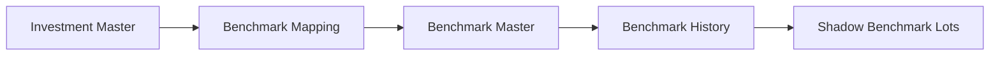
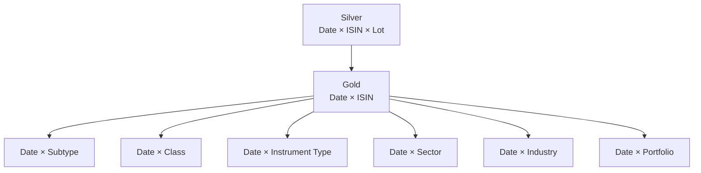

# Silver Data Contracts

Silver is the canonical financial contract layer.

It sits after source-specific Bronze state and before decision-oriented Gold.

```text
Source-shaped Bronze
        ↓
canonical transformation
        ↓
Silver contracts
        ↓
investment / wealth / planning analytics
```

The current architecture publishes **20 Silver contracts**:

```text
11 dimensions / reference models
9 facts
```

This document focuses on:

```text
identity
grain
producer
physical contract
financial meaning
```

rather than narrating the transformation pipeline again.

---

## Contract model

Serving identity is explicit:

```python
@dataclass
class DataContract:
    contract_id: str
    layer: str
    physical_table: str
    domain: str
    grain: str
    producer: str
    publication_order: int
```

Silver publication uses the registry rather than inferring physical identity from DataFrame names.

---

## Contract catalog

## Dimensions and reference models

| Physical table | Domain | Primary analytical role |
| --- | --- | --- |
| `silver.d_Calendar` | Shared | Canonical calendar/time semantics |
| `silver.d_Income_Category` | Household | Income classification |
| `silver.d_Income_Subcategory` | Household | Income sub-classification |
| `silver.d_Expense_Category` | Household | Expense classification |
| `silver.d_Expense_Subcategory` | Household | Expense sub-classification |
| `silver.d_Asset_Category` | Household | Asset classification |
| `silver.d_Asset_SubCategory` | Household | Asset sub-classification |
| `silver.d_Currency` | Shared | Currency reference |
| `silver.d_Investment_Benchmark_Master` | Investments | Benchmark identity/mapping |
| `silver.d_Investment_Master` | Investments | Instrument identity and analytical/tax classification |
| `silver.d_Macro_Parameters` | Investments | Macro/reference parameters |

## Facts

| Physical table | Domain | Core grain |
| --- | --- | --- |
| `silver.f_Income_Transactions` | Household | Income transaction |
| `silver.f_Expense_Transactions` | Household | Expense transaction |
| `silver.f_Transfer_Transactions` | Household | Transfer transaction |
| `silver.f_Opening_Balances` | Household | Opening state by asset |
| `silver.f_Investment_Market_Data` | Investments | Date × ISIN |
| `silver.f_Investment_Purchase_Data` | Investments | Purchase event |
| `silver.f_Investment_Sale_Data` | Investments | Sale event |
| `silver.f_Investment_Benchmark_Data` | Investments | Date × Benchmark |
| `silver.f_Investment_Analytics_Lot` | Investments | Date × ISIN × Lot |

---

## Household dimensions

## `d_Income_Category`

**Purpose:** canonical income category.

Typical relationship:

```text
Income Transaction
      ↓
Income Subcategory
      ↓
Income Category
```

The dimension prevents raw/source labels from becoming permanent BI semantics.

---

## `d_Income_Subcategory`

**Purpose:** lower-grain income classification.

This supports questions such as:

```text
salary
dividend
interest
other active/passive streams
```

without requiring Power BI to reverse-engineer source transaction descriptions.

---

## `d_Expense_Category`

**Purpose:** canonical expense category.

It is part of the household semantic model, not merely a chart label.

FinancialRules can further classify categories for:

```text
cash/non-cash treatment
core/non-core treatment
cash-flow activity
```

---

## `d_Expense_Subcategory`

**Purpose:** lower-grain expense classification.

Category/subcategory separation allows detailed consumption analysis while preserving a stable higher-level reporting hierarchy.

---

## `d_Asset_Category`

**Purpose:** canonical household asset grouping.

The dimension supports:

```text
wealth aggregation
cash-pool policy
liquidity interpretation
asset reporting
```

---

## `d_Asset_SubCategory`

**Purpose:** lower-grain asset classification.

This lets the model preserve useful asset detail without forcing every Gold mart to operate at the most detailed asset taxonomy.

---

## `d_Currency`

**Purpose:** canonical currency reference.

Currency is explicit reference state rather than an implicit property of whichever source supplied a transaction.

---

## Shared time model

## `d_Calendar`

**Purpose:** canonical date/time dimension.

Time appears across:

```text
household transactions
investment transactions
market observations
tax holding periods
monthly marts
FIRE planning
```

A shared calendar keeps period semantics consistent across domains.

Typical attributes can include:

```text
date
month
year
financial period attributes
```

The exact physical fields should be read from the current DDL.

---

## Investment dimensions

## `d_Investment_Master`

This is one of the most important Silver contracts.

**Grain:** one canonical instrument identity.

Important semantics include:

```text
ISIN
instrument name
instrument type
instrument subtype
instrument class
sector
industry
benchmark identity
tax type / subtype
```

The investment engine relies on this state for both analytics and methodology.

### Data quality

The Silver loader checks critical identity/tax fields.

Production logic includes checks such as:

```python
if table_name == "silver.d_Investment_Master":
    if "ISIN" in df.columns:
        missing_isin = df.filter(
            pl.col("ISIN").is_null()
        )

    if "TAX_TYPE" in df.columns:
        missing_tax = df.filter(
            pl.col("TAX_TYPE").is_null()
        )
```

A row can be structurally valid while still being financially unusable.

Missing instrument identity or tax classification is therefore surfaced.

---

## `d_Investment_Benchmark_Master`

**Purpose:** connect investment identity/classification to benchmark identity.

This contract supports the shadow benchmark portfolio.



Benchmark mapping is semantic infrastructure.

It is not merely a label displayed beside an investment.

---

## `d_Macro_Parameters`

**Purpose:** macro/reference state consumed by planning and analytical methodology.

The exact parameters can evolve.

The important contract principle is that external/model assumptions should enter through explicit reference/configuration state rather than hidden literals in builders.

---

## Household facts

## `f_Income_Transactions`

**Grain:** one canonical income transaction.

**Purpose:** preserve standardized household inflow activity.

Conceptual fields include:

```text
transaction date
asset/account identity
income category
income subcategory
amount
```

FinancialRules determines downstream semantic treatment such as cash/non-cash classification.

### Additivity

Amount is generally additive across compatible transaction dimensions.

Rates/ratios derived from income are not.

---

## `f_Expense_Transactions`

**Grain:** one canonical expense transaction.

**Purpose:** preserve standardized household outflow/consumption activity.

Conceptual fields:

```text
transaction date
asset/account identity
expense category
expense subcategory
amount
```

Downstream policy can distinguish:

```text
cash expense
non-cash expense
core expense
```

The Silver fact itself preserves canonical activity before decision-specific aggregation.

---

## `f_Transfer_Transactions`

**Grain:** one canonical transfer event.

**Purpose:** represent internal household movement without manufacturing income/expense.

```text
Asset A
   ↓
Transfer
   ↓
Asset B
```

### Financial invariant

```text
transfer amount
≠ household income
≠ household expense
```

Transfers can affect cash-flow classification while remaining wealth-neutral at household level.

---

## `f_Opening_Balances`

**Grain:** opening state by asset/account context.

**Purpose:** initialize reconstructed financial state when complete lifetime transaction history is unavailable.

### Financial invariant

```text
opening balance
≠ income
```

The contract exists to establish starting state, not to fabricate historical activity.

---

## Investment transaction facts

## `f_Investment_Purchase_Data`

**Grain:** purchase event.

**Purpose:** canonical capital-deployment history used to create FIFO lots.

The shared investment engine needs enough state to reconstruct:

```text
ISIN
purchase date
quantity
purchase price / deployed capital
```

Asset-specific pipelines must normalize their source representation into this contract.

---

## `f_Investment_Sale_Data`

**Grain:** sale event.

**Purpose:** canonical disposal history used to consume FIFO inventory.

The engine needs:

```text
ISIN
sale date
quantity
sale price / proceeds
```

The sale contract does not decide which historical lot was sold.

FIFO methodology does that downstream.

---

## `f_Investment_Market_Data`

**Grain:** Date × ISIN.

**Purpose:** provide valuation observations for active investment state.

```text
Date × ISIN
      ↓
market price / valuation context
      ↓
active lot market state
```

This contract enables historical investment paths rather than only latest-value reporting.

---

## `f_Investment_Benchmark_Data`

**Grain:** Date × Benchmark.

**Purpose:** benchmark price/history used by shadow benchmark lots.

The benchmark history is aligned with real capital deployment through the investment engine.

It should not be interpreted as a generic index return copied beside portfolio performance.

---

## Deep analytical fact

## `f_Investment_Analytics_Lot`

This is the deepest persistent analytical investment contract.

**Grain:**

```text
Date × ISIN × Tax Lot
```

Conceptually it carries state such as:

```text
lot acquisition context
remaining quantity
cost basis
market value
holding period
holding classification
benchmark state
realized/unrealized state
estimated tax
after-tax value
return context
```

### Why this grain survives

Suppose one ISIN has:

```text
Lot A → acquired 2022
Lot B → acquired 2024
Lot C → acquired 2026
```

At one valuation date those lots can have different:

```text
holding type
cost basis
tax rate
unrealized gain/loss
benchmark exposure
```

Aggregating them too early would destroy information required for tax-aware analytics.

---

## Lot-to-Gold lineage



At each target grain:

- additive values can be aggregated,
- weights are recomputed,
- non-additive return metrics are reconstructed.

---

## Silver publication

Silver uses the same registry-driven publication pattern as Gold.

Conceptually:

```python
contracts = sorted(
    (c for c in DATA_CONTRACT_REGISTRY if c.layer == "silver"),
    key=lambda c: c.publication_order,
)

for contract in contracts:
    if contract.contract_id in dfs:
        self._write(
            dfs[contract.contract_id],
            contract.physical_table,
        )
```

This means Silver identity is explicit.

The loader does not infer layer/table meaning from a naming convention.

---

## Contract semantics

## Additive

Examples:

```text
transaction amount
quantity at compatible event grain
realized gain/loss
```

## Semi-additive

Examples:

```text
balance
market value
```

These can aggregate across assets at one date but not meaningfully across time.

## Non-additive

Examples:

```text
XIRR
CAGR
drawdown
rates
weights
```

These require target-grain methodology.

---

## Silver design rules

1. Silver is canonical, not source-shaped.
2. Source vocabulary should terminate upstream.
3. Grain must be explicit.
4. Transaction facts preserve financial events.
5. Opening state remains distinct from activity.
6. Transfer state remains distinct from income/expense.
7. Lot detail survives until tax-aware methodology no longer needs it.
8. Physical contracts are interfaces consumed downstream.
9. Data quality includes financial usability, not only schema validity.
10. Silver should not accumulate presentation-only metrics.

---

## Related documentation

- [Data Model](../architecture/data-model.md)
- [Investment Analytics](../finance/investment-analytics.md)
- [Financial Model](../finance/financial-model.md)
- [Gold Data Contracts](gold-data-contracts.md)

[← Reference Home](README.md) · [← Documentation Home](../README.md)
